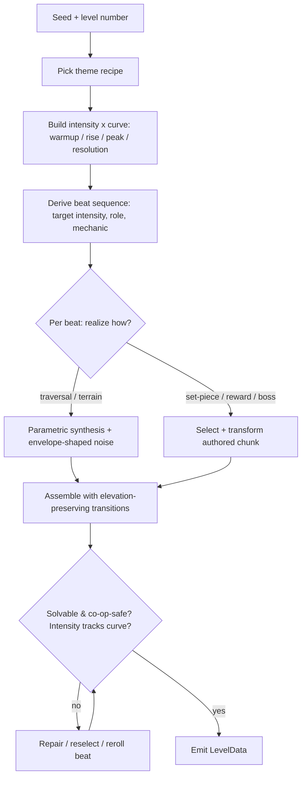

# Level Generation Variety — Requirements

## Summary

Replace the flat, random-bag Hybrid generator with an **outline-first**
architecture: every level is generated by first producing an explicit *outline*
— an intensity/difficulty curve over the level's length plus a derived beat
sequence — and then *realizing* that outline into geometry. Realization is
**hybrid**: traversal and terrain beats are parametrically synthesized (with
Perlin noise used only as an envelope-shaped texture), while set-piece, reward,
and boss beats are filled by authored chunks. The path-first floor spine is
solvable by construction (à la Spelunky); interior overlays pass a seeded
generation-time reachability gate. The arc is a first-class artifact, not an
emergent side effect — which is what makes levels feel distinct, shaped, and fun.

---

## Problem Frame

The game ships two generators. The default, `HybridGenerator`
(`src/levels/HybridGenerator.ts`), stitches hand-crafted chunks together with
procedural bridges; the pure `ProceduralGenerator` is opt-in via
`?procedural=true`. The complaint — low variety, not much fun — traces to five
concrete starvation points:

1. **Levels are structurally flat.** Every chunk in `src/levels/chunks/index.ts`
   except the two staircases declares `entryHeight: 2` / `exitHeight: 2`, so
   elevation never carries forward. A level is flat ground with props on top,
   end to end.

2. **The chunk pool is tiny (16) and collapses on easy.** Selection filters to
   `difficulty ≤ requested + 1`; at the default difficulty of 2 the eligible
   pool drops to ~11 gentle chunks and excludes every combat and hard-platforming
   chunk.

3. **Threat variety is near zero.** Chunks only ever spawn `GOOMBA`. `KOOPA` is a
   dead enum value, and `ChargingBull` — a working enemy used in `level1` — is
   never placed by either generator.

4. **Assembly has no arc.** Chunks are drawn at random from a difficulty band.
   No level has an intentional shape, a build-up, or a memorable peak — it is a
   shuffled bag.

5. **Themes are cosmetic.** The six themes in `src/levels/themes.ts` recolor and
   tint but never change structure or mechanics.

The deeper architectural problem behind #4 is that pacing was treated as a
*post-hoc ordering* of pre-chosen chunks. The fix is to invert control: decide
the arc first, then generate to fit it.

---

## Key Decisions

- **Outline-first architecture.** Generation produces an explicit outline before
  any geometry: an `intensity(x)` curve over the level's length and a derived,
  ordered beat sequence (each beat carrying target intensity, role, mechanic,
  theme). Everything downstream is subordinate to the outline. This echoes
  platformer PCG prior art (rhythm-based generation à la "Launchpad"; Dormans'
  mission-vs-space separation), but that prior art informs *components*, not the
  whole: Launchpad generates rhythm groups bottom-up rather than from a precomputed
  designer curve, and Spelunky's path-first guarantee is a room grid, not a
  height-varying side-scroll spine. The curve-driven beat derivation and the
  height-varying spine are the un-precedented pieces and warrant an early
  build-time spike. The curve is represented
  as a discrete per-beat target sequence (sampling a designer-shaped curve), not
  a continuous analytic function — its resolution is bounded by beat count, which
  is the standard EDPCG representation. For a strictly linear level the mission
  layer is a sequence, not a graph; a grammar is only warranted if beats later
  gain branching or ordering constraints (secret areas, co-op divergence).

- **Chunks are demoted to a realization strategy, not the architecture.**
  Realization is hybrid: parametric synthesis for traversal/terrain beats,
  authored chunks for set-piece / reward / boss beats. The standalone
  `HybridGenerator` and `ProceduralGenerator` are superseded; their useful guts
  are salvaged — chunk placement and bridging from the former, parametric
  gap/platform/coin synthesis from the latter — into the new realizers.

- **Perlin noise is a texture brush, not a spine.** Noise is used only as an
  envelope-shaped terrain texture (amplitude/frequency scaled by `intensity(x)`)
  for ground undulation and cave ceilings — never as the structural layout and
  never for semantic object placement. Stationary noise has no arc and no
  solvability awareness, so using it as the generator would work against the
  variety-and-arc goal, not for it.

- **Difficulty is three coarse hand-set bands, not a calibrated score.** Each
  beat targets one of three bands — easy / medium / peak — and the arc is the band
  sequence (e.g. easy → medium → peak → easy). A simple rubric assigns a realized
  segment its band from countable features (gap count/width, enemy count, height
  demand) against fixed hand-set thresholds — no leniency-weight playtest
  calibration and no co-op multiplier. (The leniency literature informs which
  features matter; we use it as a guide, not a calibrated formula.) This keeps
  difficulty intentional and cheap for an easy family co-op game while still
  giving every level a legible arc.

- **Solvability is by construction for the spine, gated for the interior.** The
  level's traversable floor spine is laid out *first* (Spelunky's path-first
  model); segment-to-segment transitions are drawn only from a precomputed
  `reachable[dx][dy]` table built to a conservative **3-tile design apex** (the
  engine's no-hold jump floor is ~2.3 tiles and full variable-hold reaches ~4;
  3 tiles leaves margin) plus run-speed horizontal reach — ceiling clearance is a
  separate dimension, not the jump-apex number. Spine + connectors are thus
  solvable by construction. Interior overlays (CA/low ceilings, gaps, dynamic
  platforms, enemies) can still block the path, so they pass a generation-time
  accept/reject reachability check that rerolls within the seed — still
  deterministic per seed, just not first-try. The check's algorithm (a 3D
  jump-value BFS/A* vs. a simpler forward-chain replay of the table) is a planning
  choice. Local adjacency constraints alone are insufficient (they admit globally
  uncompletable levels), which is why both the spine guarantee and the interior
  gate exist.

- **The chunk↔synthesis seam is the highest-risk boundary, handled by explicit
  connectors.** Hybrid generators consistently report that the hardest bug class
  is the join between authored chunks and parametric content (tile misalignment,
  jump geometry that works inside a chunk but fails at the transition). Every
  adjacency between two beats is bridged by an explicit connector step that is
  generated and reachability-validated independently. Authored chunks are
  annotated at authoring time with their measured difficulty (leniency) range and
  entry/exit heights, and are only selected when the beat's target falls in
  range — otherwise the curve-following guarantee breaks silently.

- **Themes are recipes, not palettes.** A theme constrains the outline and the
  realizers (chunk pool, enemy mix, noise profile, ceiling pressure), so a
  Cavern level is structurally different from a Sky level.

- **Deliver in phases; Phase 1 is a shippable gate.** Phase 1 — the outline spine
  + chunk-driven realization + enemy roster + reachability + structural themes
  realized through chunks — is built as a complete, shippable deliverable that
  must independently satisfy the Success Criteria. It also expands/transforms the
  chunk pool so every band target (easy trough through peak, including a
  boss/high-intensity reward) has ≥N in-range, non-repeating candidates. Phases 2
  and 3 are **not committed up front**: after playing Phase 1, decide whether the
  variety/fun gap still justifies Phase 2 (parametric synthesis + envelope-shaped
  noise) and Phase 3 (new mechanics + set-pieces — the riskiest, last). The
  existing `HybridGenerator` stays live behind a flag until Phase 1 reaches
  parity, so a stalled build never leaves the game worse than today. Placing the
  existing Koopa and Bull folds into Phase 1.

---

## Generation Pipeline

The outline-first, hybrid-realization pipeline as an on-ramp to the prose below:

---

## Requirements

**Outline & arc (the spine)**

- R1. Generation produces an explicit outline before any geometry: an
  `intensity(x)` curve over the level's length plus a derived, ordered beat
  sequence, each beat carrying a target intensity, a role, a mechanic, and the
  theme.
- R2. Each level's arc has a clear shape — warmup, rising action, a single
  dominant peak, and a resolution. Consecutive levels vary the curve shape and
  beat sequence so no two back-to-back levels feel like reruns.
- R3. Difficulty is three coarse hand-set bands — easy / medium / peak. Each beat
  targets a band, and a simple rubric (gap count/width, enemy count, height demand
  vs. fixed thresholds) assigns a realized segment its band. No calibrated
  leniency weights and no co-op multiplier; the arc is the band sequence.

**Realization (filling the outline)**

- R4. Beats are realized by a hybrid strategy: traversal/terrain beats are
  parametrically synthesized; set-piece, reward, and boss beats are realized from
  authored chunks. The outline drives the choice of strategy per beat.
- R5. Authored chunks are selected and transformed (mirror, height-shift,
  reskin, enemy swap) to match a beat's target intensity, role, verticality, and
  theme — not drawn from a random difficulty band.
- R6. Parametric synthesis produces terrain/traversal geometry from a beat's
  parameters, using Perlin/simplex noise only as an envelope-shaped texture
  (amplitude/frequency scaled by `intensity(x)`) for ground undulation — never as
  the structural layout and never for semantic object placement. Cave/ceiling
  geometry uses cellular automata for the gross shape followed by a connectivity
  pass (flood-fill + carve), with intensity biasing initial wall density; the
  passable floor spine remains the construction-time solvability guarantee, not
  the noise/CA layer.
- R7. Elevation flows across the whole level: realized segments carry varied
  entry/exit heights and the spine preserves continuity. Every adjacency between
  two beats is bridged by an explicit connector step that produces a traversable
  transition (steps, ramps, short stairs) and is reachability-validated
  independently — never an unjumpable wall or a floating, unreachable ledge.

**Solvability & invariants**

- R8. Every generated level is completable. The traversable floor spine and its
  connectors are solvable by construction — transitions are drawn only from the
  physics-derived `reachable[dx][dy]` table (built to a conservative 3-tile design
  apex). Interior overlays (ceilings, gaps, dynamic platforms, enemies) pass a
  generation-time accept/reject reachability check that rerolls within the seed if
  they block the path — deterministic per seed. The check verifies a complete
  spawn→exit path; its algorithm (3D jump-value BFS/A* vs. a simpler forward-chain
  replay of the table) is deferred to planning.
- R9. Seeded reproducibility is preserved: the same seed and level number yield
  the same level.
- R10. Co-op safety is preserved: two player spawns, the bubble-tether behavior,
  and camera assumptions hold; dynamic elements behave sanely with two players,
  including a bubbled player. Reachability is validated from both spawn points
  (the exit must be reachable from the more-constrained spawn), mandatory passage
  points enforce a minimum platform width of ≥2 tiles, and per-segment width
  stays within camera-tether range.
- R11. No degenerate output: nothing buried inside solid tiles (extend the
  existing `liftCoins` safety to all placed entities), no enemies trapped on
  walls, no soft-locks.

**Threat & reward variety**

- R12. The full working enemy roster — Goomba, Koopa, ChargingBull — is placed in
  role-appropriate positions, driven by beat role and intensity, not Goombas
  alone.
- R13. Reward variety extends beyond the question-block roll: coin-route
  challenges, hidden caches, and optional risk/reward side paths, mapped to
  reward beats.

**Themes as structure**

- R14. Themes are recipes that constrain the outline and realizers (chunk pool,
  enemy mix, noise profile, ceiling pressure), not just palette. Cavern = low
  ceilings + denser enemies + pits; Sky = floating platforms + longer gaps + no
  low ceilings; Underground = coin-dense, tight corridors.

**New mechanics & set-pieces (Phase 3)**

- R15. New placeable gameplay elements the realizer can deploy: moving platforms,
  falling/crumbling platforms, and springboards/trampolines.
- R16. Set-piece beats: a ChargingBull mini-boss encounter, and at least one
  special level type the outline can select as a whole-level template (vertical
  ascent and/or auto-scroll).

---

## Acceptance Examples

- AE1. **Covers R1, R2.** Given a new level, when generation runs, then an
  outline (curve + beat sequence) exists before any tiles are placed, the curve
  has a single dominant peak, and — given the previous level's curve and climax
  beat — the new level uses neither the same curve shape nor the same climax
  archetype.
- AE2. **Covers R3, R6.** Given a beat targeting high intensity versus a warmup
  beat, when both are realized, then the high-intensity segment scores higher on
  the complexity metric, and noise amplitude near the peak is greater than in the
  warmup — yet noise never produces an unjumpable wall (validation catches it).
- AE3. **Covers R4.** Given a reward or boss beat, when it is realized, then it
  comes from an authored chunk; given a traversal beat, then it is parametrically
  synthesized.
- AE4. **Covers R7, R8.** Given two adjacent beats whose entry/exit heights
  differ, when the connector is generated, then its transition is drawn only from
  the `reachable[dx][dy]` table, so a climbable path exists by construction; the
  offline validator confirms a continuous path from each spawn to the exit and
  flags any seed where one does not (a constraint-table bug, not a shipped
  level).
- AE5. **Covers R14.** Given the Cavern theme, when a level is generated, then it
  has low ceilings, above-baseline enemy density, and at least one pit; given the
  Sky theme, then floating platforms and longer gaps and no low-ceiling
  corridors.

---

## Success Criteria

- **Distinctness:** across five consecutive generated levels, a player can
  identify each as structurally distinct — different overall shape, different
  theme-driven mechanics, a different peak.
- **Verifiable arc:** the realized band sequence matches the intended arc — a
  single peak band with easier shoulders. Since bands are assigned by an
  intentional rubric rather than re-derived from a generated score, the structural
  arc is legible directly; spot-check felt difficulty with playtest deaths/retries
  if a level seems off.
- **Solvability:** the offline reachability validator passes across a large seed
  sample (e.g., 1,000 seeds × default difficulty) with zero unbeatable levels.
  Because generation is constrained by construction, this is expected to hold by
  design; the check exists to catch constraint-table or connector bugs.
- **Variety surface:** a typical single run surfaces more than one enemy type and
  at least one dynamic (non-static) element.

---

## Scope Boundaries

**Deferred for later (in scope overall, later phases):**

- Auto-scroll level type if it proves hard to reconcile with the co-op camera —
  ship the vertical-ascent special type first.
- Enemy archetypes beyond the existing Goomba / Koopa / Bull roster.
- Hand-authored "campaign" levels — this effort is about the generator.

**Out of scope:**

- Rewriting core player physics or controls.
- Networked multiplayer.
- A level-editor UI.
- An art/asset overhaul beyond the minimum new tiles/sprites the new mechanics
  require.

---

## Dependencies / Assumptions

- The existing entities `ChargingBull`, `PowerUp`, and `QuestionBlock` work as
  shipped and can be placed without behavioral changes.
- `KOOPA` is currently an enum value with no distinct behavior (`Enemy.ts` is a
  generic patrol AI). "Place Koopa" (R12) assumes Koopa is made at least visually
  or behaviorally distinct; whether it needs shell behavior is a planning-time
  call.
- The player jump/run envelope bounds all reachability work (R8). `Player.ts` has
  a variable jump (gravity 1200, jump velocity −420, plus a hold force over
  ~250ms): the no-hold floor is ~2.3 tiles, full hold reaches ~4. The reachable
  table is built to a conservative **3-tile design apex** (run speed TBD from
  `Player.ts`); ceiling clearance is sized as a separate dimension, not the
  jump-apex number.
- The co-op camera follows the lead/active player; vertical and auto-scroll
  level types (R16) must be compatible with that and with bubbled players (R10).
- A noise implementation is needed (a small `simplex-noise`/value-noise
  dependency or a hand-rolled function); choice deferred to planning.
- Replacing the global `Math.random` monkeypatch seeding with an injected seeded
  RNG is desirable for deterministic generation and testable validation;
  mechanism deferred to planning.

---

## Outstanding Questions

**Deferred to planning:**

- Curve shape vocabulary: which band-sequence presets (and how many beats per
  level) the director draws from, and how each beat's band target is set.
- The exact band-assignment rubric: which countable features and what fixed
  thresholds map a segment to easy / medium / peak.
- The exact role split between "synthesize" and "use a chunk" per beat type.
- The minimum safe step size for height transitions, and confirming the empirical
  max jump reach against `src/entities/Player.ts` vs. the 3-tile design apex (and
  the tile size in use).
- The interior-gate / reachability-check algorithm: a 3D jump-value BFS/A* vs. a
  simpler forward-chain replay of the `reachable[dx][dy]` table.
- Noise: library vs. hand-rolled; 1D fBm for terrain, cellular automata for caves.
- How special level types (vertical ascent, auto-scroll) fit the linear outline
  model — a whole-level template vs. a beat — and whether auto-scroll is in the
  first cut of Phase 3.
- Whether Koopa gets distinct shell behavior or is a reskinned patrol enemy.

---

## Sources / Research

- `src/levels/HybridGenerator.ts` — current default; chunk placement + bridging
  logic to salvage into chunk realization.
- `src/levels/ProceduralGenerator.ts` — opt-in pure procedural; parametric
  gap/platform/coin synthesis to salvage into parametric realization.
- `src/levels/chunks/index.ts` — the 16 current chunks; all flat except the two
  staircases.
- `src/levels/types.ts` — `LevelChunk`, `ChunkTag`, `TileType`, `EnemyType`.
- `src/levels/themes.ts` — six cosmetic themes (to become structural recipes).
- `src/scenes/GameScene.ts` — `genMode` selection (~L129), seed handling
  (~L118), enemy spawning incl. `BULL` branch (~L317), power-up spawning.
- `src/entities/ChargingBull.ts`, `src/entities/PowerUp.ts`,
  `src/entities/Enemy.ts` — working but under-used by generation.
- `src/levels/level1.ts` — hand-built level that uses `BULL`, a reference for
  set-piece placement.

**External prior art (informs components — not whole-architecture validation):**

- Rhythm-based generation (rhythm grammar → geometry grammar): Smith, Whitehead,
  Mateas, "Launchpad," IEEE TCIAIG 2011 —
  https://users.soe.ucsc.edu/~ejw/papers/Smith-Launchpad-TCIAIG-2011.pdf ; FDG
  2009 — https://eis.ucsc.edu/papers/smith-fdg-09.pdf
- Mission-vs-space separation: Dormans, "Adventures in Level Design," FDG PCG
  Workshop 2010 — https://pcgworkshop.com/archive/dormans2010adventures.pdf
- Experience-driven PCG / difficulty curves: Yannakakis & Togelius, "EDPCG,"
  IEEE TAC 2011; PCG Book ch.10 — https://www.pcgbook.com/chapter10.pdf
- Difficulty metrics (leniency, linearity): Shaker et al., "Digging Deeper into
  Platform Game Level Design," 2012; Summerville et al., "Understanding Mario,"
  2017 — https://webdocs.cs.ualberta.ca/~santanad/papers/2017/summervilleMSOL17.pdf
- Solvability by construction / local-constraint failure: Charity et al.,
  "Literally Unplayable," FDG 2024 —
  https://dl.acm.org/doi/fullHtml/10.1145/3649921.3659844
- Spelunky path-first generation: Darius Kazemi tutorial —
  https://tinysubversions.com/spelunkyGen/
- Reachability-indexed template stitching: kode80, "Level Generation for Platform
  Games," 2015 —
  https://kode80.com/blog/2015/02/02/level-generation-for-platform-games/index.html
- Jump-arc pathfinding (3D jump-value node space): Tuts+ "Adapting A* to a 2D
  Grid-Based Platformer" ; Beresford, "Pathfinding in 2D Platformers," 2024 —
  https://eliotberesford.com/2024/09/25/pathfinding-in-2d-platformers.html
- Playability validation via A* agent: Mario AI Framework —
  https://github.com/amidos2006/Mario-AI-Framework
- Hybrid graph + templates (structural solvability): Deepnight, "The Level Design
  of Dead Cells: A Hybrid Approach" —
  https://deepnight.net/tutorial/the-level-design-of-dead-cells-a-hybrid-approach/
- TypeScript reference implementation: sgalban/platformer-gen-2D —
  https://github.com/sgalban/platformer-gen-2D
- Caves: Jeremy Kun, "Cellular Automaton Method for Cave Generation" —
  https://www.jeremykun.com/2012/07/29/the-cellular-automaton-method-for-cave-generation/

---

## Deferred / Open Questions

### From 2026-06-14 document review

Resolved during review: DR4 (scope) → Phase 1 is a shippable gate, Phases 2–3
gated on a post-Phase-1 playtest (see Key Decisions). DR8 (difficulty) → coarse
hand-set bands, calibration + co-op multiplier dropped (see Key Decisions, R3).

Still open (deferred to planning):

- DR6 (R6, caves): CA + flood-fill cave generation may be over-specified for a
  single sub-case of one theme. Consider restating R6 as an outcome ("passable
  irregular low ceilings above the spine") and deferring the CA-vs-parametric
  ceiling algorithm to planning. (scope-guardian)
- DR7 (R16, special level types): Vertical-ascent and auto-scroll are a different
  camera mode that fights the centroid/zoom co-op camera. Deferred to later;
  Phase 3 keeps the ChargingBull mini-boss + moving/crumbling/spring platforms.
  (scope-guardian)
