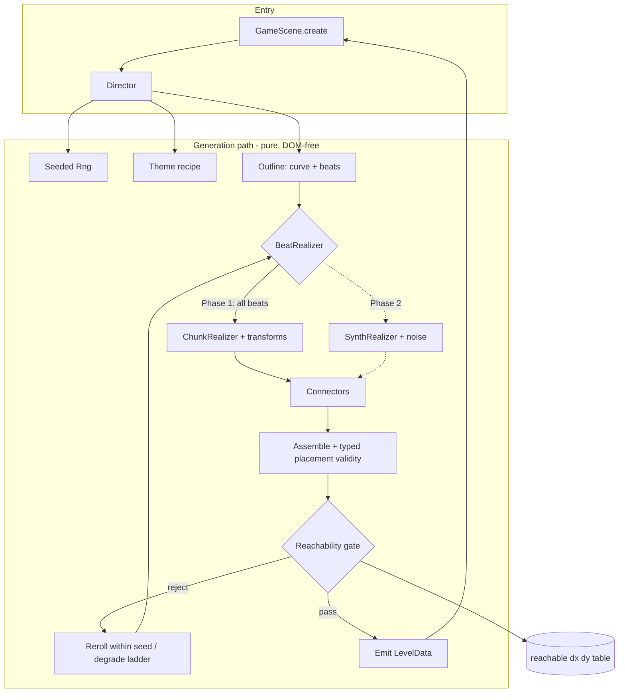
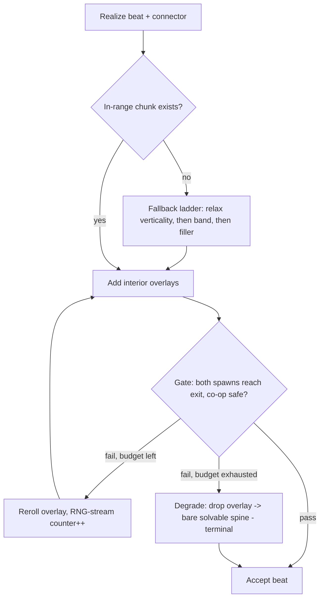

# feat: Outline-first level generation

## Summary

Replace the flat random-bag `HybridGenerator` with an **outline-first** generator: every
level first produces an explicit *outline* — an `intensity(x)` curve plus a derived ordered
beat sequence — and then *realizes* that outline into geometry. Phase 1 (the shippable gate)
realizes beats from an **expanded, transformed authored-chunk pool**, bridges every beat
adjacency with a connector drawn from a physics-derived `reachable[dx][dy]` jump table,
places the full Goomba/Koopa/Bull roster by beat role, makes themes structural recipes, and
guarantees solvability via a 3D jump-arc reachability gate run from both co-op spawns. A
seeded RNG and the reachability validator are built first as foundations. Parametric
synthesis + noise (Phase 2) and new mechanics + set-pieces (Phase 3) are a gated roadmap,
decided after a Phase 1 playtest. The existing `HybridGenerator` stays live behind a flag
until the new director reaches parity.

---

## Problem Frame

The default generator (`src/levels/HybridGenerator.ts`) stitches hand-crafted chunks with
procedural bridges; pacing is a *post-hoc ordering* of pre-chosen chunks, so levels feel
flat and same-y. The brainstorm (see origin) traces "low variety, not much fun" to five
starvation points, confirmed in code by research:

- **Structurally flat** — 14 of 16 chunks declare `entryHeight: 2 / exitHeight: 2`
  (`src/levels/chunks/index.ts`); only the two staircases carry elevation. Elevation never
  flows across a level.
- **Tiny pool that collapses on easy** — at the default difficulty 2, the
  `getChunksByDifficulty(difficulty + 1)` filter drops the eligible pool to ~11 gentle
  chunks and excludes every combat chunk.
- **Near-zero threat variety** — chunks only spawn `GOOMBA`. `KOOPA` is a dead enum value
  rendered as a goomba (no branch in `GameScene.createEnemies`); `ChargingBull` works and is
  used in `level1` but is never placed by a generator.
- **No arc** — chunks are drawn at random from a difficulty band; no build-up, no peak.
- **Cosmetic themes** — the six themes in `src/levels/themes.ts` recolor only, and are even
  selected *after* generation has already run.

The fix is to invert control: decide the arc first, then generate to fit it. This is a
cross-cutting rewrite of the generation subsystem touching RNG/determinism, a new
solvability layer, the chunk pool, enemy placement, themes, and `GameScene` integration —
hence a phased delivery with Phase 1 as an independently shippable gate.

---

## High-Level Technical Design

### Module architecture

The director orchestrates outline → realize → validate → emit. Realization is behind a
`BeatRealizer` strategy interface so Phase 2's parametric synthesizer slots in beside the
Phase 1 chunk realizer without touching the director. Everything on the generation path is
pure and DOM-free (no Phaser import) so it runs in Node for the offline sweep.



### Generate → validate → reroll control flow

The spine + connectors are solvable *by construction* (transitions drawn only from the
reachable table). Interior overlays can still block the path, so they pass an accept/reject
gate that rerolls **within the seeded stream** (the reroll counter is part of the RNG state,
so a fixed seed always produces the same outcome). A bounded reroll budget feeds a
deterministic degrade ladder so generation can never hang.



### Reachability model

The gate is a 3D jump-arc BFS over nodes `(tileX, tileY, speedClass)` where `speedClass ∈
{stand, run}` captures the **air-speed cap** (a running jump must reach run speed on the
ground before takeoff; `src/entities/Player.ts:158`). Edges come from a precomputed
`reachable[speedClass][dx][dy]` table generated by simulating the actual jump integrator
(gravity 1200, launch −420, hold −25/frame over 250 ms, early-release halving) to a
conservative 3-tile design apex. Ceiling clearance is a **separate hard constraint** checked
along the arc, not the apex number. Falls (downward edges) are generous. BFS from each player
spawn must reach the exit tile; the more-constrained spawn binds (R10).

---

## Key Technical Decisions

KTD1. **Outline is an explicit artifact built before any geometry.** The director produces
an `Outline { curve, beats }` where `curve` is a discrete per-beat target-band sequence
(sampling a designer-shaped curve, not a continuous analytic function) and each `Beat`
carries `{ targetBand, role, mechanic, theme, verticalityClass }`. Everything downstream is
subordinate to the outline. Rationale: pacing as a first-class artifact is what makes levels
feel shaped; the discrete per-beat representation is the standard EDPCG form and its
resolution is bounded by beat count (see origin Key Decisions).

KTD2. **Realization is a strategy interface; Phase 1 ships the chunk strategy only.** A
`BeatRealizer` interface (`realize(beat, ctx): RealizedSegment`) has one Phase 1
implementation, `ChunkRealizer`. The interface is designed so `SynthRealizer` (Phase 2) slots
in per-beat-role without director changes. To keep Phase 2 genuinely additive, `RealizedSegment`
is defined now as an **edge-profile + semantic-placement contract, not a scalar height
contract**: its entry/exit edges are described as the standable surface column(s) the connector
must mate to (plus an "open/gap edge" flag), so a flat chunk is the degenerate case where the
profile is constant and a Phase-2 fBm-undulated synth segment is the general case. Entity/reward
placement is returned as **semantic placement requests** (enemy-of-role-at-region, reward-here),
which the shared placement layer (KTD13) resolves — *not* as chunk-coordinate spawn lists, so the
synthesizer never has to fabricate chunk-shaped metadata. `ctx` carries the `rng` fork, the theme
recipe, the target band, and the neighbor edge profile (typed explicitly in U5, since a vague
`ctx` is where chunk-specific assumptions silently accrete). Rationale: honors the brainstorm's
chunk-first Phase 1 while keeping the hybrid architecture (R4) real, not retrofitted; the
edge-profile contract is the single change most likely to prevent a Phase-2 interface break.
Acknowledged tradeoff: with only `ChunkRealizer` registered, every Phase-1 test exercises the
degenerate (constant-profile) case — the general edge-profile form is not fully validated until
Phase 2's `SynthRealizer` lands. This is a deliberate design-for-extension bet, not free.

KTD3. **Seeded RNG is injected end-to-end; the global `Math.random` monkeypatch is removed.**
A single `Rng` object (`next()`, `int(n)`, `range(a,b)`, `pick(arr)`, `chance(p)`,
`fork(label)`) is threaded through every generation consumer. A test stubs `Math.random` to
throw during generation to prove no consumer escapes. Per-level seed = a well-mixed hash of
`(baseSeed, levelNumber)` (e.g. mulberry32 seeded by a hash, **not** `base + level*1000`,
which mixes adjacent seeds poorly). Rationale: deterministic per-seed generation (R9),
reroll-within-seed, and a Node-runnable offline sweep all require pure injected randomness;
the legacy LCG (`*9301+49297 %233280`, duplicated in both generators) is fragile and
short-period. (Resolves flow-analysis C5.)

KTD4. **Question-block contents are decided at generation time and carried in a LevelData
sidecar array.** `QuestionBlock`'s constructor currently rolls `Math.random()` at load time,
*outside* the seed window (`src/entities/QuestionBlock.ts:25`), so two players on the same seed
get different contents. The tile grid is a bare `number[][]` (`TileType.QUESTION = 3`) with no
per-tile metadata channel, so contents ride in a **sidecar array on `LevelData`** —
`questionBlockContents: { x, y, containsPowerUp }[]`, mirroring the existing `enemySpawns` /
`coinSpawns` shape. Generation decides each block's content; `LevelLoader.createTile` looks it
up and passes it to the `QuestionBlock` constructor (which gains a `containsPowerUp` param).
Explicitly **not** by widening `TileType` (e.g. `QUESTION_POWERUP = 7`) — that would push a
generation concern into the shared terrain vocabulary every generator, chunk literal, and the
validator read. Rationale: R9 reproducibility and reachability reasoning that depends on
power-up availability; keeps the tile grid a pure terrain array. (Resolves flow-analysis C4,
feasibility F1.)

KTD5. **The reachable table is generated by simulating the real jump integrator, with a
trajectory-conformance test — not constant-equality.** The physics constants are *extracted*
from `src/entities/Player.ts` into one **new** shared Phaser-free module (`src/physics.ts`) that
both `Player.ts` and the table import — eliminating the duplicate-constant class entirely rather
than papering over it with a drift test. (Note: `src/config.ts` does **not** export a gravity
constant today — gravity is an inline literal inside the Phaser `gameConfig` object at
`config.ts:21`, and `config.ts` imports Phaser, so it cannot be the shared home. `config.ts:21`
should also be changed to import the `1200` value from `src/physics.ts` so there is a single
source of truth across `Player.ts`, the table, and the Phaser config.) The table is built by a forward-Euler simulation of the variable-jump arc
(launch, per-frame hold force over 250 ms, early-release halving, air accel), parameterized by
takeoff speed-class, recording reachable `(dx, dy)` landing cells plus swept ceiling clearance
to a 3-tile design apex. Critically, the load-bearing test is **arc-trajectory conformance**, not
constant equality: a recorded `(x, y)`-per-frame fixture of a real `Player` jump (captured via a
thin headless harness) that the offline integrator must reproduce within tolerance. A
constant-equality test would pass green while the re-implemented integrator loop diverges in
per-frame ordering (when `airSpeedCap` latches, whether hold-force applies the landing frame,
`delta/16.67` quantization) — which is exactly the "gate certifies unbeatable levels" top risk.
Rationale: fidelity to the engine; the air-speed cap and early-release halving are stateful and
the *integration logic*, not just the constants, must match. (Strengthened by architecture review.)

KTD6. **The reachability gate is a 3D `(x, y, speedClass)` BFS and is the SOLE accept/reject
authority. BotController is advisory only.** Forward-chain replay of the table is rejected
because it cannot model run-up runway, backtracking, or ceiling-vs-apex separation, and would
certify unbeatable levels. The BotController (a regression oracle that already caught the
bridge-height and floating-flag bugs) has a known false positive — a 2-tile step makes it
hesitate for seconds though humans clear it instantly — so it must never gate ship/reject; it
runs post-hoc with a long timeout and "hesitation ≠ failure." Standable surfaces are defined as
GROUND, PLATFORM, and PIPE-top tiles (matching how `LevelLoader` makes tiles collidable —
`src/levels/LevelLoader.ts:65-86`); EMPTY and coins are not standable (stating this prevents a
silent false-reject class, e.g. forgetting pipe tops are standable). A **strict conservative
invariant** governs required traversal: the table and BFS assume *standing* body height and *no*
coyote-time extension for every path the guarantee depends on. Duck/slide body-shrink
(`Player.ts:339`, fits under low gaps) and coyote time (80 ms, ~1 extra tile off a ledge) are
treated as player *bonuses*, never as path prerequisites — so a Cavern low-ceiling corridor must
admit a standing-height path or be rejected; the gate never assumes ducking to certify a passage.
Rationale: correctness of the solvability guarantee (R8) over reuse of the bot; an unmodeled
stateful behavior used as a prerequisite is a guarantee leak. (Resolves flow-analysis C6, M1;
feasibility F5; standable-surface definition from architecture review.)

KTD7. **Spine solvable by construction; interior overlays gated with a bounded reroll +
deterministic degrade ladder; the bare spine is the terminal fallback.** The traversable floor
spine and its connectors use only table-drawn transitions (solvable by construction). Interior
overlays pass the gate; on failure they reroll within the seed up to a hard cap, then degrade
deterministically: drop the failing overlay → fall back to the **bare solvable spine** (terminal).
The bare spine is the floor because it is construction-guaranteed and emits the correct LevelData
shape. Falling back to `HybridGenerator` is **rejected** as a degrade rung: its only seeding
mechanism is the `Math.random` monkeypatch this plan removes (`HybridGenerator.ts:382-391`), it
does not emit the new `questionBlockContents` channel (KTD4), and it provides no solvability
guarantee — so a Hybrid rung would abandon every Phase 1 invariant at the exact moment the new
generator failed. `HybridGenerator` stays alive only as the `?hybrid=true` parity-comparison route
(U9), not as a runtime degrade target. Generation runs synchronously in `GameScene.create`, so the
reroll cap must be a **measured** wall-clock budget, not an assumption: the U10 sweep records
p99/max generation time, and the validator re-validates **incrementally over the returned failing
region** (U3) rather than re-running the full BFS per reroll — the incremental hook is what makes
the synchronous boundary safe. Rationale: local adjacency alone admits globally uncompletable
levels (see origin); the cap prevents a load hang. (Resolves flow-analysis C1; feasibility F8;
budget/incremental-revalidation from architecture review.)

KTD8. **Build-time chunk-pool coverage assertion (authored chunks only) + empty-cell fallback
order.** A test enumerates the `(theme × band × verticalityClass)` request matrix the director
**actually emits at the default difficulty** — not the full 6×3×3 = 54-cell cross product — and
asserts ≥N non-repeating candidates per cell; the build fails on an empty cell. Coverage counts
**authored chunks only**; transforms (mirror/height-shift/enemy-swap, U5) do *not* count toward N,
so the assertion (U6) is verifiable before U5's transform logic lands. At runtime, an
empty/exhausted cell falls back: relax verticality → relax band by one → (the deferred
traversal-filler segment, if promoted) → error. Scoping caveat: the pool today is 16 chunks (14
flat, Goomba-only), so even the reduced matrix is a multi-fold authoring increase; KTD14's
theme-legality filter *partitions* the pool per theme rather than multiplying a shared one. If the
reduced matrix still can't be authored at N≥2, the traversal-filler is promoted from deferred to a
committed Phase 1 unit (see Open Questions). Rationale: Phase 1 is chunk-only and the current pool
collapses on easy; silent curve-break is the failure mode to design out, but the gate must be
greenable. (Resolves flow-analysis C2; feasibility F6, F7.)

KTD9. **Difficulty is three coarse hand-set bands (easy / medium / peak), not a calibrated
score.** The arc is the band sequence with a single dominant peak. A countable-feature rubric
(gap count/width, enemy count, max height step, ceiling pressure vs. fixed thresholds) is
used to **verify** a realized segment's band for the legibility check — not to drive
selection. No leniency-weight calibration, no co-op multiplier. Rationale: intentional and
cheap for an easy family co-op game (see origin, R3).

KTD10. **Cold start / variation is computed statelessly from the seed.** Because each level's
outline is a pure function of `(baseSeed, levelNumber)`, the director computes the *previous*
level's curve archetype + climax on demand (pure recompute of `levelNumber - 1`) to exclude
repeats (R2) — nothing is persisted across the per-level scene recreation, so it survives a
page reload mid-run. Level 1 uses a fixed gentle opener (no peak archetype) since a family
co-op game should not open on a peak. (Resolves flow-analysis C3.)

KTD11. **Connectors are first-class; the assembly contract is edge-profile mating, with a
strict chunk-specific metadata check.** Every beat adjacency is bridged by an explicit connector
generated and reachability-validated independently. A build-time check asserts each authored
chunk's declared `entryHeight`/`exitHeight` and ceiling clearance match its actual tiles — this
strict scalar-equality check is scoped to **chunks specifically**. At assembly, the connector
mates to the realized segment's **edge profile** (KTD2), not a scalar height; for a flat chunk
that degenerates to `connector.exitHeight === chunk.entryHeight`, but the general contract is
profile-mating so a Phase-2 synth segment with an undulated or gap edge assembles through the same
path without a contract change. Rationale: the chunk↔connector seam is the highest-risk bug class
(tile misalignment, transition jumps that work inside a chunk but fail at the join); scoping the
scalar check to chunks keeps the cross-strategy assembly contract from leaking chunk assumptions.
(Resolves flow-analysis I5; edge-profile scoping from architecture review.)

KTD12. **Co-op safety is an explicit, testable contract, not playtest-and-hope.** Generation
guarantees: (a) both spawns reach the exit *and* a shared in-tether path exists (no disjoint
reachable regions); (b) a continuous bubble-safe headroom corridor along the spine (≥ bubble
height + margin) so a player freed from a bubble on the spine restores gravity in open space;
(c) per-beat forced-divergence length < `MAX_PLAYER_DISTANCE` (900 px) minus margin; (d) ≥2-tile
platform width at mandatory passage points. **Runtime caveat the guard must respect (review
finding):** the bubble today has *no solid collider* — `updateBubble` moves the body by direct
position writes and seeks the lead player through walls (`src/entities/Player.ts:404-457`), so a
spine headroom corridor cannot prevent every pop-into-solid (a bubble freed mid-wall is a runtime
path the generator can't constrain), and (c) is a static-geometry proxy for what is really a
seek-dynamics problem (the trailing/smaller-x player bubbles first and is freed by overlap). The
clean reconciliation — add a bubble↔solid collider vs. keep these as best-effort generation
guards — is a directional decision (see Open Questions). Rationale: these ship as intermittent
soft-locks, not crashes, if left implicit. (Resolves flow-analysis I1–I4; runtime caveat from
adversarial review.)

KTD13. **Typed placement validity replaces "lift coins up."** `liftCoins`
(`src/levels/HybridGenerator.ts:330`) only walks up and silently drops fully-buried coins.
Generalize to per-entity rules: coins lift; question-block contents require emit headroom
(reject ceiling-flush placement rather than lifting into the ceiling); enemies require floor
+ patrol runway; exit/spawns require open + reachable. For bulls the rule is **bounded standable
floor on both charge directions within charge range, not merely a back-wall** — `ChargingBull`
stops a charge only on `body.blocked.left/right` and has `setCollideWorldBounds(false)`
(`src/entities/ChargingBull.ts`), so a back-wall stops only the away-direction charge while a
charge toward an open front edge runs the bull off the level. Rationale: R11 "no degenerate
output" covers more than buried coins, a dropped reward-beat coin is invisible content loss, and
a bull self-destructing off a pit silently degrades the set-piece beat. (Resolves flow-analysis
M2, I7; bull charge-lane from adversarial review.)

KTD14. **Themes are structural recipes, level-locked.** `Theme` gains structural fields
(allowed chunk tags/pool, enemy-mix weights, ceiling-pressure flag, gap-length bias) read by
the director, and the theme is threaded *into* generation (today it is picked in `GameScene`
after generation runs). Theme stays level-number-locked (`themeForLevel`) for deterministic
world progression; cycling six themes already yields distinct themes across five consecutive
levels (Success Criteria). When a theme constraint conflicts with a band target, **theme
wins** and the band re-targets to the nearest achievable band within the theme; the arc
legibility check uses the *achieved* band. Rationale: R14; a Cavern level should be
structurally different from a Sky level. (Resolves flow-analysis I6, M5.)

KTD15. **Koopa ships as a reskinned patrol enemy in Phase 1; shell behavior deferred.** Koopa
gets a distinct generated texture (via the `drawPixels` pixel-map convention in `BootScene`)
and a `GameScene.createEnemies` branch / slightly different speed, satisfying R12's "at least
visually or behaviorally distinct" cheaply. Shell-kick mechanics are deferred follow-up.
Rationale: keeps Phase 1 bounded; honors the no-binary-asset convention.

KTD16. **Noise is hand-rolled (Phase 2).** When parametric synthesis lands, terrain uses a
small hand-rolled 1D fBm (value noise) seeded from the injected `Rng`, and irregular ceilings
use cellular automata + a flood-fill connectivity pass — no new dependency. The passable
spine remains the construction-time guarantee, never the noise/CA layer; noise is an
envelope-shaped texture (amplitude/frequency scaled by intensity), never structural layout or
semantic object placement. Rationale: zero deps, determinism under our control; DR6 allows
restating the cave requirement as an outcome and deferring the algorithm.

---

## Requirements

Carried from the origin requirements doc, grouped by concern, annotated with delivery phase.
R-IDs are stable across both documents.

**Outline & arc (the spine) — Phase 1**

- R1. Generation produces an explicit outline before any geometry: an `intensity(x)` curve
  plus a derived, ordered beat sequence, each beat carrying a target intensity, role,
  mechanic, and theme.
- R2. Each level's arc has a clear shape — warmup, rising action, a single dominant peak, a
  resolution. Consecutive levels vary the curve shape and beat sequence; no two back-to-back
  levels feel like reruns.
- R3. Difficulty is three coarse hand-set bands (easy / medium / peak). Each beat targets a
  band; a simple countable-feature rubric assigns a realized segment its band. No calibrated
  leniency weights, no co-op multiplier.

**Realization (filling the outline)**

- R4. Beats are realized by a hybrid strategy — traversal/terrain synthesized, set-piece /
  reward / boss from authored chunks; the outline drives the choice. *Phase 1 ships the chunk
  half behind the `BeatRealizer` interface; the synthesis half is Phase 2.*
- R5. Authored chunks are selected and transformed (mirror, height-shift, reskin, enemy swap)
  to match a beat's target intensity, role, verticality, and theme. *Phase 1.*
- R6. Parametric synthesis produces terrain/traversal geometry, using noise only as an
  envelope-shaped texture; cave/ceiling geometry uses CA + a connectivity pass; the passable
  spine stays the construction-time guarantee. *Phase 2.*
- R7. Elevation flows across the whole level; every adjacency is bridged by an explicit,
  independently reachability-validated connector — never an unjumpable wall or floating ledge.
  *Phase 1.*

**Solvability & invariants — Phase 1**

- R8. Every generated level is completable. Spine + connectors solvable by construction
  (table-drawn transitions, 3-tile design apex); interior overlays pass a generation-time
  accept/reject reachability gate that rerolls within the seed; the gate verifies a complete
  spawn→exit path.
- R9. Seeded reproducibility: same seed + level number yields the same level.
- R10. Co-op safety: two player spawns, bubble-tether, and camera assumptions hold;
  reachability validated from both spawns (exit reachable from the more-constrained spawn);
  mandatory passages ≥2 tiles wide; per-segment width within camera-tether range; dynamic
  elements behave sanely with a bubbled player.
- R11. No degenerate output: nothing buried in solid tiles (typed placement validity for all
  entities), no enemies trapped on walls, no soft-locks.

**Threat & reward variety — Phase 1**

- R12. The full working roster — Goomba, Koopa, ChargingBull — is placed in role-appropriate
  positions driven by beat role and intensity, not Goombas alone.
- R13. Reward variety beyond the question-block roll: coin-route challenges, hidden caches,
  optional risk/reward side paths, mapped to reward beats.

**Themes as structure — Phase 1**

- R14. Themes are recipes that constrain the outline and realizers (chunk pool, enemy mix,
  noise profile, ceiling pressure), not just palette. Cavern = low ceilings + denser enemies
  + pits; Sky = floating platforms + longer gaps + no low ceilings; Underground = coin-dense,
  tight corridors.

**New mechanics & set-pieces — Phase 3 (gated, not committed)**

- R15. New placeable elements: moving platforms, falling/crumbling platforms,
  springboards/trampolines.
- R16. Set-piece beats: a ChargingBull mini-boss encounter, and at least one special level
  type the outline can select as a whole-level template (vertical ascent first; auto-scroll
  deferred).

---

## Output Structure

New and changed files for Phase 1 (per-unit `Files` sections are authoritative; the
implementer may adjust this layout if implementation reveals a better one):

```text
src/levels/
  rng.ts                         # U1  injected seeded RNG
  rng.test.ts                    # U1
  director/
    Director.ts                  # U4  top-level orchestrator (new entry point)
    outline.ts                   # U4  Outline/Beat/Band types + derivation
    curves.ts                    # U4  curve archetype vocabulary
    bands.ts                     # U4/U9  band defs + verification rubric
    Director.test.ts             # U4
    outline.test.ts              # U4
  realize/
    BeatRealizer.ts              # U5  strategy interface
    ChunkRealizer.ts             # U5  select + transform authored chunks
    transforms.ts                # U5  mirror / height-shift / reskin / enemy-swap
    connectors.ts                # U5  table-drawn beat-adjacency bridges
    placement.ts                 # U5  typed placement validity (generalized liftCoins)
    *.test.ts                    # U5
  types.ts                       # U1  add questionBlockContents sidecar field
  LevelLoader.ts                 # U1  createTile reads questionBlockContents sidecar
  reachability/
    reachableTable.ts            # U2  simulated jump-arc table (imports src/physics.ts)
    validator.ts                 # U3  3D (x,y,speedClass) BFS gate + co-op checks
    *.test.ts                    # U2/U3  incl. arc-trajectory conformance fixture
    fixtures/                    # U3  hand-built failure-shape levels
    solvability.sweep.test.ts    # U10 1,000-seed sweep
  chunks/
    index.ts                     # U6  expanded + elevation-varied + annotated pool
    coverage.test.ts             # U6/U8 (theme x band x verticality) coverage assertion
  themes.ts                      # U8  structural recipe fields
  tools/
    sweep.ts                     # U10 node-runnable sweep entry (optional CLI, excluded from Vite bundle)
src/
  physics.ts                     # U2  shared Phaser-free physics constants (Player.ts + table import)
  config.ts                      # U2  gravity literal -> import GRAVITY from physics.ts
src/entities/
  Enemy.ts                       # U7  variant param: texture key + patrol speed
  Player.ts                      # U2  import constants from src/physics.ts
  QuestionBlock.ts               # U1  constructor gains containsPowerUp param
src/scenes/
  BootScene.ts                   # U7  Koopa pixel-map texture
  GameScene.ts                   # U9  director genMode branch, theme threading, GOOMBA/KOOPA dispatch
settings.ts                      # U9  GenMode union + director default + legacy flag
vitest.config.ts                 # U2  test harness
package.json                     # U2  add vitest + test/sweep scripts
```

---

## Implementation Units (Phase 1 — committed, shippable gate)

### U1. Seeded RNG foundation

Goal: Replace the global `Math.random` monkeypatch with an injected `Rng` threaded through
the generation path, and move the question-block content roll into deterministic generation.

Requirements: R9. Dependencies: none.

Files:
- `src/levels/rng.ts` (new) — `Rng` class/factory: `next()`, `int(n)`, `range(a,b)`,
  `pick(arr)`, `chance(p)`, `fork(label)`; mulberry32 (or xoshiro) seeded by a hash of
  `(baseSeed, levelNumber)`.
- `src/levels/rng.test.ts` (new).
- `src/entities/QuestionBlock.ts` (modify) — constructor gains a `containsPowerUp` param
  (currently `:25` rolls `Math.random()`); no roll at construction.
- `src/levels/types.ts` (modify) — add `questionBlockContents: { x, y, containsPowerUp }[]`
  sidecar to `LevelData` (mirroring `enemySpawns`/`coinSpawns`), per KTD4.
- `src/levels/LevelLoader.ts` (modify) — `createTile` looks up the sidecar entry for a
  `QUESTION` tile and passes `containsPowerUp` to the `QuestionBlock` constructor.

Approach: `Rng` is a value object created once per level from the mixed seed and passed into
the director. `fork(label)` returns a child stream so independent subsystems (curve, beat,
realizer, overlay reroll) don't desync when one changes call count. The reroll counter
(KTD7) advances the same stream, keeping rerolls deterministic. Question-block contents are
chosen during generation and carried in the `questionBlockContents` sidecar array (KTD4 —
explicitly not by widening `TileType`); `LevelLoader` reads it and threads it into the
`QuestionBlock` constructor. Do not introduce a noise/RNG npm dependency (KTD3, KTD16).

Patterns to follow: mirror the existing LevelData shape in `src/levels/types.ts`; keep the
module Phaser-free so it imports in Node.

Test scenarios:
- Covers R9. Same `(baseSeed, levelNumber)` → identical sequence from two `Rng` instances
  (first 1,000 draws byte-identical).
- Adjacent levels: `(seed, N)` and `(seed, N+1)` produce well-separated streams (first draws
  differ; no obvious correlation) — guards against the `+level*1000` low-bit-mixing problem.
- `fork('a')` and `fork('b')` from the same parent are independent and each reproducible.
- `int(n)` is uniform over `[0, n)` (chi-square sanity over a large sample), never returns
  `n`, handles `n = 1`.
- Covers R9. Question-block contents: same seed → identical `containsPowerUp` per block
  across two generations.

Verification: a generated `LevelData` is byte-identical across repeated runs of the same
seed, including question-block contents.

### U2. Physics-derived reachable table + offline test harness

Goal: Stand up the Node test harness and generate the `reachable[speedClass][dx][dy]` jump
table by simulating the real jump integrator.

Requirements: R8. Dependencies: U1.

Files:
- `vitest.config.ts` (new); `package.json` (modify) — add `vitest` devDependency, `test`
  and `sweep` scripts.
- `src/physics.ts` (new) — new standalone, Phaser-free physics constants module extracted from
  `Player.ts`: `GRAVITY=1200`, `JUMP_VELOCITY=-420`, `JUMP_HOLD_FORCE=-25`,
  `MAX_JUMP_HOLD_TIME=250`, `RUN_SPEED=350`, `WALK_SPEED=200`, `AIR_ACCELERATION=600`,
  air-speed cap, `COYOTE_TIME=80`, `TILE=32`, design apex = 3 tiles. Standalone (not under
  `entities/` or `levels/`) so both an entity and the generation path can import it with no
  awkward layering direction.
- `src/entities/Player.ts` (modify) — import its constants from `src/physics.ts` (single
  source of truth; eliminates the duplicate-constant class entirely — KTD5).
- `src/config.ts` (modify) — replace the inline `gravity: { x: 0, y: 1200 }` literal
  (`config.ts:21`) with the imported `GRAVITY` from `src/physics.ts`, so the `1200` value has one
  home.
- `src/levels/reachability/reachableTable.ts` (new) — `buildReachableTable()` returning the
  per-speed-class `(dx, dy)` reachability set plus the swept ceiling-clearance profile of
  each arc.
- `src/levels/reachability/*.test.ts` (new), including the arc-trajectory conformance fixture.

Approach: forward-Euler the variable jump (launch −420; while held ≤250 ms add −25 per
~16.67 ms frame; early release halves upward velocity) under gravity 1200, with horizontal
position advanced at the fixed takeoff speed-class (air-speed cap: `stand`≈walk, `run`=350).
Record every `(dx, dy)` landing cell up to the 3-tile design apex, and for each the minimum
headroom required along the arc (ceiling clearance as a separate dimension, KTD5/KTD6). The
generator core is already Phaser-free (the existing generators import only `./types` and
`./chunks`; the salvageable guts are pure array math) — extraction is a shallow refactor, not a
rewrite; the only impurity to remove is global `Math.random` (U1).

Patterns to follow: the live traversal heuristics in `src/systems/BotController.ts`
(`JUMP_HOLD_MS=240`, `GAP_LOOKAHEAD`, backup-and-run-up) as a sanity cross-check on the
table's horizontal reach — but the table is derived from physics, not from the bot.

Test scenarios:
- Covers R8. Arc-trajectory conformance (the load-bearing test): a recorded `(x, y)`-per-frame
  fixture of a real `Player` jump (captured via a thin headless harness) is reproduced by the
  offline integrator within tolerance — catches per-frame integration-logic drift that a
  constant-equality test cannot (KTD5).
- A flat run (`dy=0`) is reachable to at least the bot's `GAP_LOOKAHEAD`-equivalent
  horizontal distance at `run`; `stand` reaches strictly less.
- Vertical reach to the 3-tile design apex is reachable; 4+ tiles up is not (conservative
  margin below the real ~4-tile full-hold ceiling).
- A landing cell that requires more headroom than available along its arc records a clearance
  value exceeding a low ceiling (so the validator can reject it).
- `run`-class horizontal reach > `stand`-class for the same `dy` (air-speed cap encoded).
- Table build is pure/deterministic and Phaser-free (imports and runs under Node/vitest).

Verification: `npm test` runs in Node; the table reproduces identically and the arc-conformance
fixture passes within tolerance.

### U3. Reachability validator (3D jump-arc BFS gate)

Goal: The sole accept/reject solvability authority — a 3D `(x, y, speedClass)` BFS that
verifies a complete spawn→exit path from both co-op spawns, plus the co-op safety checks.

Requirements: R8, R10. Dependencies: U2.

Files:
- `src/levels/reachability/validator.ts` (new) — `validate(level): ValidationResult` with
  reachability (both spawns), bubble-safe-corridor, forced-divergence, and passage-width
  checks; returns pass/fail + the failing region; plus `revalidateRegion(level, region)` for
  incremental re-checking after a targeted reroll (KTD7).
- `src/levels/reachability/fixtures/` (new) — hand-built failure-shape levels.
- `src/levels/reachability/validator.test.ts` (new).

Approach: standable surface tiles are GROUND/PLATFORM/PIPE-top (matching
`src/levels/LevelLoader.ts:65-86`); EMPTY/coin are not. A multi-tile PIPE column is standable
only on its top row but is a solid **wall** for horizontal traversal — the validator must model
the body-as-wall so it doesn't walk through a pipe. Nodes are standable tiles paired with arrival
speed-class; edges come from the reachable table (jumps up/across from `run`/`stand`), plus
generous falls and same-level walks, with ceiling clearance enforced per edge under the strict
standing-height/no-coyote invariant (KTD6). A `run`-class edge carries a **runway precondition**:
because air speed latches at takeoff (`Player.ts:158`), a `run` jump is only reachable when the
takeoff tile is preceded by ≥N standable runway tiles to accelerate from a standing start (N
derived from `ACCELERATION=1200` → `RUN_SPEED=350` over `TILE=32`) — the BFS must verify the
runway, not just emit the `run` edge, or the no-runway case leaks. BFS from each player spawn;
require the exit reachable from both, the binding spawn being the more-constrained one (R10). Add co-op checks
(KTD12): a shared in-tether path exists (no disjoint reachable regions); a continuous
bubble-safe headroom corridor along the spine; per-beat forced-divergence <
`MAX_PLAYER_DISTANCE − margin`; ≥2-tile width at mandatory passages. The reroll loop calls
`revalidateRegion` over the returned failing region rather than re-BFSing the whole level, so
synchronous-generation cost stays bounded (KTD7). Decision: backtracking is permitted in the
search (it correctly accepts more beatable levels) but the forced-divergence bound keeps co-op
players from being split by long backtracks.

Patterns to follow: A* / jump-value node-space pattern from the cited prior art (kode80,
Mario-AI-Framework) — adapted to read the static tile array offline, unlike `BotController`
which reads the live physics world.

Test scenarios:
- Covers R8. Accepts a hand-built beatable level (flat spine + a 2-tile step + a table-width
  gap).
- Covers R8. Rejects the **no-runway gap** fixture (a table-width gap immediately after a
  height step, with no ground to reach run speed) — the air-speed-cap case.
- Covers R8. Runway boundary: a `run`-class gap preceded by exactly N−1 runway tiles is rejected;
  the same gap with N runway tiles is accepted (the runway precondition is enforced, not just the
  zero-runway case).
- A multi-tile pipe column blocks horizontal traversal (treated as a wall); only its top row is a
  valid standing node.
- Covers R8. Rejects the **ceiling-capped jump** fixture (apex-reachable landing blocked by a
  low ceiling along the arc).
- Accepts a **backtrack-required** fixture (a ledge only reachable by moving left/up first).
- Covers R10. Rejects a level whose two spawns are in disjoint reachable regions; accepts when
  a shared in-tether path exists.
- Covers R10. Rejects a mandatory 1-tile-wide passage; accepts ≥2 tiles.
- Covers R10. Rejects a beat whose forced-divergence length exceeds the tether bound.
- Rejects a level with no bubble-safe headroom corridor (a low-ceiling stretch a bubble would
  pop into).
- Covers R8/R10. A standing-height path exists through a Cavern-style low-ceiling corridor (the
  gate never relies on ducking, KTD6); a corridor that admits only a ducking path is rejected.
- `revalidateRegion` over a failing region returns the same verdict as a full `validate` on the
  mutated level (incremental check is sound), and touches only the region's neighborhood.
- Determinism: validation result is identical across runs for the same level.

Verification: all failure-shape fixtures reject and all beatable fixtures accept; the
validator runs in Node with no Phaser import.

### U4. Outline director (curve, beats, bands)

Goal: Produce the explicit outline — `intensity(x)` curve + derived beat sequence with a
single dominant peak — and vary it from the (statelessly recomputed) previous level.

Requirements: R1, R2, R3. Dependencies: U1.

Files:
- `src/levels/director/curves.ts` (new) — curve archetype vocabulary (e.g.
  `classic`, `double-hump`, `slow-burn`, `front-loaded`, `plateau`), each a band sequence
  with one dominant peak.
- `src/levels/director/outline.ts` (new) — `Outline`, `Beat`, `Band`, `Role`,
  `VerticalityClass` types; `deriveOutline(rng, levelNumber, theme): Outline`.
- `src/levels/director/bands.ts` (new) — band definitions + the countable-feature
  verification rubric (KTD9).
- `src/levels/director/Director.ts` (new) — top-level orchestration shell (realization wiring
  completed in U5/U9).
- `src/levels/director/outline.test.ts`, `Director.test.ts` (new).

Approach: pick a curve archetype seeded by `rng`, excluding the archetype + climax that
`(baseSeed, levelNumber-1)` would produce (KTD10, stateless recompute). Level 1 forces a
fixed gentle opener. Derive 6–9 beats (count from `rng`, bounded so warmup/rise/peak/
resolution stay distinct and the reserved start/end zones fit — flow-analysis M3); assign each
a band per the curve, a role (traversal / combat / reward / set-piece) and a mechanic, and the
level theme. Width and beat count derive from `rng` (flow-analysis M4). The rubric in
`bands.ts` is consumed by the legibility check (U10), not by selection.

Patterns to follow: `configForDifficulty` in `src/levels/ProceduralGenerator.ts` as a
reference for band→parameter mapping shape.

Test scenarios:
- Covers R1. `deriveOutline` returns a curve + ordered beats before any tiles exist; every
  beat carries band, role, mechanic, theme.
- Covers R2. Every archetype has exactly one dominant peak band.
- Covers R2. Level N and N+1 (same seed) differ in curve archetype AND climax archetype.
- Covers R2/R10 cold start. Level 1 always yields the canonical gentle opener (no peak
  archetype), reproducibly, from a cold settings object.
- Beat count and width are within bounds and deterministic per seed; the smallest allowed
  width still yields ≥4 distinguishable bands plus reserved start/end zones.
- Rubric: a constructed segment with 3 gaps + 4 enemies + a 2-tile step scores `peak`; a
  flat 1-enemy segment scores `easy`.

Verification: dumping outlines for levels 1–5 of a fixed seed shows five distinct, single-peak
arcs with no back-to-back archetype repeat.

### U5. Chunk realizer, connectors, and typed placement validity

Goal: Realize each beat from the authored-chunk pool (select + transform), bridge adjacencies
with table-drawn connectors, and assemble with elevation continuity and typed placement
validity.

Requirements: R4 (chunk half), R5, R7, R11. Dependencies: U2, U3, U4; U6 for full-pool
integration only. (U5's unit tests run against a small stub chunk pool — 2-3 synthetic chunks
sufficient to exercise selection, transforms, connectors, and the fallback ladder — so U5 is
verifiable without waiting on U6's full authored pool; integration tests against the real pool
land with U6.)

Files:
- `src/levels/realize/BeatRealizer.ts` (new) — the strategy interface (KTD2). Defines
  `RealizedSegment` as an **edge-profile** (entry/exit standable column(s) + open/gap-edge flag)
  + **semantic placement requests** (enemy-of-role-at-region, reward-here), and the typed `ctx`
  (`rng` fork, theme recipe, target band, neighbor edge profile).
- `src/levels/realize/ChunkRealizer.ts` (new) — select an in-range chunk for a beat; apply the
  empty-cell fallback ladder (KTD8).
- `src/levels/realize/transforms.ts` (new) — mirror, height-shift, reskin, enemy-swap.
- `src/levels/realize/connectors.ts` (new) — connector synthesis using only reachable-table
  transitions; mate to the segment edge profile (KTD11; scalar equality for the flat-chunk case).
- `src/levels/realize/placement.ts` (new) — typed placement validity resolving semantic
  placement requests, generalizing `liftCoins` (KTD13).
- `src/levels/realize/*.test.ts` (new).

Approach: salvage `placeChunk` (bottom-aligned overlay) and the `generateBridge`
height-interpolation from `src/levels/HybridGenerator.ts` — lifting them out of the class's
mutable `this.tiles/this.coinSpawns/this.enemySpawns` instance state into **pure functions over an
explicit builder/accumulator** (they are private and `this`-bound today, so they can't be called
directly). Tighten the integer-step math against the reachable table so transitions are always
table-valid (no 1-tile-off seams, the documented unclimbable-wall class). Salvage the
`isFlatBase`/`flatGap` gap-carve guard from `addBridgeFeatures`. On an empty/exhausted request
cell, walk the fallback ladder (relax verticality → relax band → optional filler → error).
`placement.ts` resolves the realizer's semantic placement requests into concrete spawns under
per-entity rules: coins lift; question-block contents need emit headroom (reject ceiling-flush);
enemies need floor + patrol runway and bulls need a bounded charge lane (standable floor on both
charge directions within charge range, not just a back-wall — KTD13); exit/spawns need open +
reachable.

Early integration checkpoint (after this unit): a throwaway dev-flag route loads **one** directed
level (hardcoded outline, before U6's full pool exists) into `GameScene` against the real
`LevelLoader`/physics — surfacing the two highest-risk bug classes (table-fidelity and the
chunk↔connector seam) ~4 units before U9, since they pass unit tests but fail on screen.

Patterns to follow: `HybridGenerator.placeChunk` (`:165`), `generateBridge` (`:206`),
`addBridgeFeatures` gap guard (`:262`), `liftCoins` (`:330`); `src/levels/level1.ts` for
set-piece/elevation reference.

Test scenarios:
- Covers R4. A reward/set-piece/boss beat is realized from an authored chunk (the chunk
  strategy is the only one registered in Phase 1).
- Covers R5. A chunk is height-shifted/mirrored/enemy-swapped to match a beat's verticality,
  band, and theme; the transform preserves declared entry/exit heights.
- Covers R7. A connector between two beats with differing entry/exit heights uses only
  reachable-table transitions and mates exactly to the neighbor's edge profile (for flat chunks
  this reduces to `connector.exitHeight === next.entryHeight`).
- Covers R7. No connector produces an unjumpable wall or a floating ledge (validator passes on
  the spine by construction).
- Covers R8/R10. Empty `(theme×band×verticality)` cell triggers the fallback ladder
  deterministically rather than crashing or silently breaking the curve.
- Covers R11. Coins inside solids lift to the first open cell; a fully-buried coin with no
  headroom is repositioned (not silently dropped) or its host beat re-rolled.
- Covers R11. A question block flush against the ceiling is rejected/relocated (not lifted into
  the ceiling); a placed enemy always has ≥K patrol runway; a placed bull always has a bounded
  charge lane (standable floor on both charge directions within charge range) — a bull with an
  open pit/world-edge in either charge lane is rejected.
- After assembly, zero placed entities intersect solid tiles; both spawns and the exit are open
  and on the reachable spine.

Verification: a fully realized level from a fixed seed passes the U3 validator with the spine
solvable by construction and zero placement violations.

### U6. Chunk pool expansion + coverage assertion + metadata validation

Goal: Expand and re-annotate the chunk pool so every `(theme × band × verticality)` cell the
director **actually emits at the default difficulty** has ≥N non-repeating *authored* candidates,
add elevation variety and reward-variety chunks, and validate chunk metadata against geometry.

Requirements: R5, R7, R13. Dependencies: U4. (Independently verifiable: coverage counts authored
chunks only, so this unit's assertion does not wait on U5's transform logic — KTD8.)

Files:
- `src/levels/chunks/index.ts` (modify/expand) — add elevation-varied chunks (varied
  `entryHeight`/`exitHeight`), a boss/high-intensity reward chunk, reward-variety chunks
  (coin-route challenge, hidden cache, optional risk/reward side path); annotate each chunk
  with measured band (via the U4 rubric) and verified entry/exit heights.
- `src/levels/chunks/coverage.test.ts` (new) — build-time coverage + metadata-vs-geometry
  assertions (KTD8, KTD11).
- `src/levels/types.ts` (modify) — extend `LevelChunk`/`ChunkTag` with band, verticality, and
  theme-legality annotations as needed.

Approach: today only `stairClimb`/`stairDescend` vary elevation and only `pipeGauntlet`/
`enemyRush` carry enemies (Goomba only). Add chunks covering easy-trough through peak per
verticality class, including at least one high-intensity reward/boss chunk and reward-variety
chunks for R13. Annotate each chunk with its rubric-measured band so selection is by target,
not by the legacy `difficulty ≤ requested+1` band filter (which is discarded). New tiles use
the `drawPixels` generated-texture convention.

Patterns to follow: existing chunk literals in `src/levels/chunks/index.ts`;
`src/levels/level1.ts` for elevation + coin-route + set-piece patterns;
`ProceduralGenerator.generateCoins` arc table (`:316`) for coin-route shapes.

Test scenarios:
- Covers R5/R7. The coverage test enumerates the `(theme × band × verticality)` cells the
  director emits at the default difficulty (not the full 54-cell cross product) and asserts ≥N
  non-repeating *authored* candidates per cell (transforms excluded); an artificially emptied
  cell fails the build.
- Covers R7. Every chunk's declared `entryHeight`/`exitHeight` equals its actual edge floor
  rows; a deliberately mis-declared chunk fails the metadata check.
- Each chunk's annotated band equals the U4 rubric's score of its geometry (annotations can't
  drift from reality).
- Covers R13. At least one coin-route-challenge chunk, one hidden-cache chunk, and one
  risk/reward side-path chunk exist and are tagged `reward`.
- A theme-illegal chunk (e.g. low-ceiling tiles) is rejected by the Sky theme-legality filter.

Verification: the coverage assertion passes for all themes at the default difficulty; the
director can satisfy every beat it emits without hitting the error branch of the fallback
ladder.

### U7. Enemy roster (Koopa reskin, Bull placement, role-driven mix)

Goal: Place the full Goomba/Koopa/Bull roster by beat role and intensity; give Koopa a
distinct identity and make Bull generator-placeable.

Requirements: R12. Dependencies: U4, U5.

Files:
- `src/scenes/BootScene.ts` (modify) — add a Koopa pixel-map texture (`drawPixels`).
- `src/entities/Enemy.ts` (modify) — add a constructor `variant`/`type` param controlling
  texture key and patrol speed. Today `Enemy` hardcodes `super(..., 'goomba')` (`:22`) and
  `GOOMBA_SPEED` is a module constant (`:3`) — neither is configurable, so this is a class-API
  change, not just a branch. No shell behavior (KTD15).
- `src/scenes/GameScene.ts` (modify) — in `createEnemies` (`~:317`), make the non-BULL `else`
  **dispatch on `spawn.type`** for both GOOMBA and KOOPA (today both fall through to a single
  `new Enemy(...)` → goomba sprite; there is no GOOMBA branch either); wire generator-placed
  bulls beside the existing BULL branch.
- `src/levels/realize/` enemy-selection logic (modify U5 realizer) — role/intensity → enemy
  mix weighted by theme.

Approach: the realizer chooses enemy types per beat (warmup → sparse Goomba; combat → mixed;
peak/set-piece → Bull arena) honoring theme enemy-mix weights (KTD14) and placement validity
(KTD13: bull arenas need a bounded charge lane on both directions). Koopa is visually/behaviorally distinct via the Enemy
`variant` param (texture + speed; KTD15); shell mechanics deferred.

Patterns to follow: the `BULL` branch and collider wiring in `GameScene.createEnemies`
(`:317`); `src/entities/ChargingBull.ts` for arena requirements; `src/levels/level1.ts` bull
placement (bulls on open flat stretches).

Test scenarios:
- Covers R12. The realizer's enemy-selection function returns Koopa and Bull (not only
  Goomba) across a representative beat set.
- Covers R12. A peak/set-piece beat yields a Bull placed in a valid arena (bounded charge lane on
  both directions within charge range; no pit/world-edge in either lane).
- A Koopa spawn uses the Koopa texture/branch, not the goomba fallback.
- Theme enemy-mix weights shift the distribution (Cavern denser than Sky over a sample).
- A typical single generated run surfaces more than one enemy type (Success Criteria).

Verification: build + manual run shows distinct Koopa sprites and generator-placed bulls in
role-appropriate spots; the enemy-selection logic is unit-tested in isolation from Phaser.

### U8. Structural themes

Goal: Turn the six cosmetic themes into structural recipes that constrain the outline and
realizers, and thread the theme into generation.

Requirements: R14. Dependencies: U4, U6.

Files:
- `src/levels/themes.ts` (modify) — add structural fields to `Theme` (allowed chunk
  tags/pool, enemy-mix weights, ceiling-pressure flag, gap-length bias); keep cosmetic fields.
- `src/levels/director/Director.ts` (modify) — read the theme recipe when deriving the outline
  and selecting chunks; apply theme-vs-band precedence (theme wins, band re-targets) (KTD14).
- `src/levels/chunks/coverage.test.ts` (modify) — coverage asserted per theme.
- `src/levels/themes.test.ts` (new).

Approach: `themeForLevel` stays the selection source (level-locked, deterministic; KTD14). The
director passes the theme recipe through the whole pipeline. Cavern = low ceilings + denser
enemies + pits; Sky = floating platforms + longer gaps + no low ceilings; Underground =
coin-dense + tight corridors. A theme-legality geometry filter rejects chunks that violate the
theme (e.g. low-ceiling tiles under Sky) regardless of tags.

Patterns to follow: the existing `Theme` interface and `THEMES[]` in `src/levels/themes.ts`;
`applyTerrainTint`/`createBackground` in `src/scenes/GameScene.ts` for where cosmetic fields
are consumed (unchanged).

Test scenarios:
- Covers R14. A Cavern level has low ceilings, above-baseline enemy density, and ≥1 pit
  (AE5).
- Covers R14. A Sky level has floating platforms and longer gaps and no low-ceiling corridors
  (AE5).
- Theme-vs-band conflict: a vertical peak requested under Cavern is re-targeted to the nearest
  achievable band and the level still passes the validator; the legibility check uses the
  achieved band.
- Theme selection is deterministic per level number and same-seed reproducible.

Verification: generating one level per theme shows visibly different structure (not just
recolor); the per-theme coverage assertion passes.

### U9. GameScene integration + legacy flag + determinism guard

Goal: Make the director the default generator, thread the theme into generation, keep
`HybridGenerator` behind a flag until parity, and enforce the no-global-`Math.random`
determinism guard.

Requirements: R9, R10, R12, R14. Dependencies: U1, U4, U5, U7, U8.

Files:
- `src/settings.ts` (modify) — four coordinated edits: (1) extend the `GenMode` union with
  `'director'` (today `'hybrid' | 'procedural' | 'named'`, `:7`); (2) `DEFAULT_SETTINGS.genMode
  = 'director'` (today `'hybrid'`, `:39`); (3) `?hybrid=true` becomes the legacy opt-in (today
  hybrid is the no-param default); (4) `?procedural=true` route unchanged.
- `src/scenes/GameScene.ts` (modify) — add a `director` branch to the create dispatch (`~:129`,
  an `if/else-if/else` where the `else` is hybrid — the *default* is what's being replaced);
  thread `themeForLevel` into generation (today picked at `~:145`, after generation); pass the
  mixed per-level seed (KTD3).
- `src/levels/director/Director.ts` (modify) — final entry point `generateDirectedLevel(seed,
  levelNumber, opts)`.
- determinism guard test (new) — stub `Math.random` to throw and run the **pure director call**
  (`generateDirectedLevel(...)`), not `GameScene.create`.

Approach: the director becomes the default `genMode`; `?hybrid=true` keeps the old generator
live for parity comparison until Phase 1 ships. Seed flows URL → mixed `(baseSeed,
levelNumber)` → `Rng` → director (replacing `parseInt + level*1000` and the monkeypatch).
Theme is selected and passed *into* the director. Enemy spawning consumes the new roster
(U7). Generation stays synchronous in `create()` but is bounded by the measured reroll cap
(KTD7) so it cannot hang. The throw-guard scopes to the pure director call because runtime
`Math.random` in `Player.spawnDust` (`:268`) and `AudioSynth` is intentionally *outside* the
generation window and must not be converted (feasibility F4).

Patterns to follow: existing `genMode` switch and seed handling in
`src/scenes/GameScene.ts:117-145`; `parseSettingsFromURL` in `src/settings.ts`.

Test scenarios:
- Covers R9. The determinism guard: the pure director call `generateDirectedLevel(...)` with
  `Math.random` stubbed to throw completes successfully (no generation consumer escapes the
  injected `Rng`); runtime `Math.random` sites stay out of the stubbed window.
- Default `genMode` routes to the director; `?hybrid=true` still routes to `HybridGenerator`;
  the `GenMode` union includes `'director'`.
- Seed mixing: `?seed=N` produces the mixed per-level seed, and the same URL reproduces the
  same level across reloads.
- Theme is passed into generation (the generated structure reflects the theme recipe, not just
  post-hoc tint).
- Test expectation for the Phaser-bound wiring: covered by build + manual/bot run, since
  `GameScene.create` requires the Phaser runtime; the pure director path is covered above.

Verification: `npm run build` is clean; a manual run on the default route produces directed
levels; `?hybrid=true` reproduces the old behavior for parity comparison.

### U10. Offline solvability sweep + bot advisory

Goal: Prove the solvability guarantee at scale and wire the bot as an advisory regression
oracle.

Requirements: R8, R9. Dependencies: U3, U9.

Files:
- `src/levels/reachability/solvability.sweep.test.ts` (new) — 1,000 seeds × default
  difficulty; assert validator self-consistency, generation time bounds, and arc legibility (runs
  in Node/vitest — validator and director are Phaser-free).
- `bot-sweep` harness (new) — the sampled bot check; runs **outside vitest** because
  `BotController` reads the live Phaser physics world (see Open Questions for the
  invocation-mechanism decision: separate browser/Electron script vs. extracted Phaser-free
  path-planner vs. manual QA).
- `src/levels/tools/sweep.ts` (new, optional) — Node CLI for ad-hoc larger sweeps.
- `package.json` (modify) — `sweep` (and, per the decision, `bot-sweep`) script.

Approach: generate 1,000 seeds at default difficulty through the full director pipeline and run
the U3 validator on each; assert zero rejections. **Important caveat (feasibility F9):** the
generator and the validator share the same reachable table, so this proves *self-consistency*,
not physical solvability — a table-fidelity bug would pass both. The independent physical
grounding is the arc-conformance fixture (U2) plus a **sampled bot hard-gate**: on 20–50 sampled
seeds the BotController must *complete* the level (not merely "not fail") within a generous
timeout — this converts the bot from pure-advisory to a small independent gate without hitting
its 2-tile-step false positive at scale. Because the bot needs the live physics world, the
sampled check runs in the `bot-sweep` harness, not the Node sweep. Define the failure protocol: a
bot non-completion on a validator-passing seed triggers **manual human verification** before it is
treated as a table bug or a bot false positive — never auto-pass by widening the timeout. The Node
sweep also records p99/max generation time to validate the synchronous reroll budget empirically
(KTD7). Spot-check the realized band sequence against the intended arc via the U4 rubric (single
peak, easier shoulders).

Patterns to follow: `src/systems/BotController.ts` for the live-play oracle; `tasks/lessons.md`
"the bot is a regression oracle" learning.

Test scenarios:
- Covers R8. 1,000 seeds × default difficulty: every level passes the validator (zero
  rejections — self-consistency).
- Covers R8. Sampled physical check: on 20–50 sampled seeds the bot completes the level within a
  generous timeout (independent of the shared table; the only physics-grounded solvability
  evidence at scale).
- Covers R9. Re-running the sweep yields identical pass/fail results (full-pipeline
  determinism).
- Generation budget: p99 and max full-generation time (including all rerolls) stay under the
  stated per-level budget across the 1,000 seeds.
- Arc legibility: across a sample, the realized band sequence has a single dominant peak with
  easier shoulders.
- Variety surface: a typical single run surfaces >1 enemy type and ≥1 dynamic/non-static
  element (in Phase 1, non-static = a generator-placed bull or moving set-piece chunk; full
  dynamic platforms arrive in Phase 3).

Verification: `npm run sweep` reports zero validator rejections over 1,000 seeds, a passing
sampled bot check, generation time within budget, and a legible arc distribution.

---

## Phase 2 & 3 Roadmap (gated — not committed up front)

Per the origin decision, Phases 2 and 3 are decided **after playing Phase 1**. They are
sketched here for sequencing, not specified as committed units; their detail depends on the
Phase 1 playtest. The `BeatRealizer` interface (KTD2) and injected `Rng` (KTD3) are the seams
that make them additive.

**Phase 2 — Parametric synthesis + envelope-shaped noise (completes R4, R6).**
- A `SynthRealizer` implementing `BeatRealizer` for traversal/terrain beats; the director
  routes traversal beats to it and keeps chunks for set-piece/reward/boss (KTD2).
- Salvage `ProceduralGenerator.generateGround` (section/gap walk), `generatePlatforms`,
  `generateCoins` arc table, `generateBrickFormations` into the synthesizer.
- Hand-rolled 1D fBm for ground undulation (amplitude/frequency scaled by intensity) and
  cellular automata + flood-fill connectivity for irregular ceilings — noise as texture only,
  spine still solvable by construction (KTD16). DR6 allows restating the cave requirement as an
  outcome ("passable irregular low ceilings above the spine") if CA proves over-specified.

**Phase 3 — New mechanics + set-pieces (R15, R16) — riskiest, last.**
- New placeable elements: moving platforms, falling/crumbling platforms,
  springboards/trampolines — each must behave sanely with a bubbled co-op player (KTD12).
- A ChargingBull mini-boss set-piece beat (arena-constrained, KTD13/R12).
- One special whole-level template: **vertical ascent first**; auto-scroll deferred (DR7) — both
  fight the centroid/zoom co-op camera, so vertical ascent must be reconciled with it before
  auto-scroll is even considered.

---

## Scope Boundaries

**Deferred to follow-up work (Phase 1 sequencing):**
- Koopa shell-kick behavior — Phase 1 ships a reskinned patrol enemy (KTD15); shell mechanics
  are a separate follow-up.
- An optional minimal traversal-filler synthesizer as a Phase-1 coverage safety net — held
  out unless the chunk-pool authoring volume (U6) proves impractical; pulling it in is a small
  slice of Phase 2's `SynthRealizer`.

**Deferred for later (in scope overall, later phases):**
- Parametric synthesis + envelope-shaped noise (Phase 2).
- New mechanics (moving/crumbling/spring platforms) and set-pieces (Phase 3).
- Auto-scroll level type — ship vertical ascent first; auto-scroll only if it reconciles with
  the co-op camera.
- Enemy archetypes beyond the Goomba / Koopa / Bull roster.
- Hand-authored "campaign" levels — this effort is about the generator.

**Out of scope:**
- Rewriting core player physics or controls.
- Networked multiplayer.
- A level-editor UI.
- An art/asset overhaul beyond the minimum new tiles/sprites the new mechanics require (and
  those follow the `drawPixels` generated-texture convention).

---

## Risks & Dependencies

- R8 fidelity (highest risk). If the reachable table or the 3D BFS mis-models the physics
  envelope, the gate certifies unbeatable levels. Mitigation: table derived by simulating the
  real integrator (KTD5) with an arc-trajectory conformance fixture (not just constant equality);
  failure-shape fixtures (U3); the sampled bot hard-gate (U10).
- Shared-table blind spot. The generator and validator read the *same* reachable table, so the
  1,000-seed sweep proves self-consistency, not physical solvability — a table bug passes both.
  Mitigation: the arc-conformance fixture (U2) and the independent sampled bot-completes check
  (U10) are the only physics-grounded evidence; do not treat the sweep alone as solvability proof.
- Chunk↔connector seam (known highest-risk bug class). Tile misalignment / transition jumps.
  Mitigation: first-class connectors drawn only from the table, build-time metadata-vs-geometry
  validation, edge-profile mating at assembly (KTD11); the early integration checkpoint after U5
  surfaces seam bugs against the real loader ~4 units before full integration.
- Phase 1 chunk-pool authoring volume (U6). Even the reduced (director-emitted) matrix is a
  multi-fold increase over today's 16 chunks, and the theme-legality filter partitions the pool
  per theme. Mitigation: the build-time coverage assertion (KTD8) surfaces gaps early; if the
  matrix can't be authored at N≥2 the traversal-filler is promoted to a committed unit (see Open
  Questions).
- Determinism regressions. Any generation-path consumer that keeps calling global
  `Math.random` silently desyncs. Mitigation: the throw-on-`Math.random` guard test scoped to the
  pure director call (U9) and injected `Rng` end-to-end (KTD3); runtime `Math.random` (dust,
  audio) stays out of the generation window.
- Co-op soft-locks ship as intermittent bugs, not crashes. Mitigation: the co-op safety
  contract is tested, not playtested (KTD12, U3).
- Synchronous generation in `GameScene.create` could hang on an unbounded reroll loop.
  Mitigation: hard reroll cap + bare-spine terminal fallback (KTD7), incremental region
  revalidation, and an empirically-measured generation-time budget in the sweep (U10).

Dependencies / assumptions (from origin):
- `ChargingBull`, `PowerUp`, `QuestionBlock` work as shipped and can be placed without
  behavioral changes (QuestionBlock's content *source* changes to generation-time, KTD4).
- The player jump/run envelope (`src/entities/Player.ts`, gravity 1200 global in
  `src/config.ts`) bounds all reachability work; the 3-tile design apex leaves margin below the
  ~4-tile full-hold reach.
- Tile size is 32 px throughout.
- No noise or seedable-RNG dependency is added (hand-rolled, KTD3/KTD16); `vitest` is added as
  the only new devDependency.

---

## Open Questions

Genuinely unresolved items that resolve during implementation, not product blockers.

- Traversal-filler promotion (resolves during U6). The chunk-only coverage matrix (KTD8) may not
  be authorable at ≥2 authored chunks per director-emitted cell given the 16-chunk starting pool
  and per-theme partitioning. If the coverage assertion can't be made green by hand-authoring, the
  deferred minimal traversal-filler synthesizer is promoted from Scope Boundaries to a committed
  Phase 1 unit. Decision point: when U6's coverage test first fails on a cell no reasonable
  authoring fills. (Not a product question — it's a build-vs-author trade discovered at U6.)
- Per-level generation-time budget value (resolves during U10). The exact wall-clock ceiling for
  synchronous generation-including-rerolls is set empirically from the sweep's measured p99/max on
  the dev target, then encoded as the reroll-cap bound (KTD7).
- Verticality-class granularity (resolves during U4/U6). How many verticality classes the director
  distinguishes (e.g. flat / stepped / high) directly sizes the coverage matrix; pinned when the
  curve vocabulary and rubric thresholds are tuned. Before U6 authoring begins, run the director's
  outline derivation across the themes at default difficulty to record the concrete emitted-cell
  count and choose N, converting U6's done-condition from "the assertion passes" (circular) into a
  concrete authoring target (e.g. "18 cells × 2 = 36 chunks").
- Bubble runtime safety: collider vs. generation guard (directional decision; review finding). The
  bubble currently has no solid collider and seeks the lead player through walls
  (`Player.ts:404-457`), so KTD12's spine corridor and forced-divergence are best-effort
  generation proxies, not airtight. Options: (a) add a bubble↔solid collider in `Player`/`GameScene`
  (a runtime change outside the generator that makes the corridor guard fully effective and would
  become a Phase-1 work item), or (b) keep them as best-effort generation guards and accept the
  residual mid-wall-free edge case. Needs a direction before the co-op guards in U3 are finalized.
- Headless bot invocation for the U10 sampled gate (resolves before U10). `BotController` reads the
  live Phaser physics world, so the sampled bot-completes check cannot run under vitest in Node.
  Options: a separate non-vitest browser/Electron `bot-sweep` script, extracting the bot's
  path-planning into a Phaser-free module, or reclassifying the bot gate as a manual QA step (with
  the sweep proving self-consistency only). Pick one when wiring U10; default leaning toward the
  separate-script route.

---

## Acceptance Examples

Carried from the origin requirements doc; each maps to test scenarios above.

- AE1. Covers R1, R2. Given a new level, when generation runs, an outline (curve + beat
  sequence) exists before any tiles are placed, the curve has a single dominant peak, and —
  given the previous level's curve and climax — the new level uses neither the same curve
  shape nor the same climax archetype. (U4 tests.)
- AE2. Covers R3, R6. Given a high-intensity beat vs. a warmup beat, when both are realized,
  the high-intensity segment scores higher on the rubric (and, in Phase 2, noise amplitude
  near the peak exceeds the warmup) — yet noise never produces an unjumpable wall (validation
  catches it). (U4 rubric test now; noise portion Phase 2.)
- AE3. Covers R4. Given a reward or boss beat, it is realized from an authored chunk; given a
  traversal beat, it is parametrically synthesized. (U5 covers the chunk half in Phase 1; the
  synth half is Phase 2.)
- AE4. Covers R7, R8. Given two adjacent beats with differing entry/exit heights, the
  connector's transition is drawn only from the `reachable[dx][dy]` table, so a climbable path
  exists by construction; the offline validator confirms a continuous path from each spawn to
  the exit and flags any seed where one does not. (U3, U5, U10.)
- AE5. Covers R14. Given the Cavern theme, a level has low ceilings, above-baseline enemy
  density, and ≥1 pit; given the Sky theme, floating platforms and longer gaps and no
  low-ceiling corridors. (U8 tests.)

---

## Success Criteria

- Distinctness: across five consecutive generated levels, a player can identify each as
  structurally distinct — different overall shape, theme-driven mechanics, and peak. (U4 + U8.)
- Verifiable arc: the realized band sequence matches the intended arc — a single peak band
  with easier shoulders — read directly from the intentional rubric. (U4 + U10.)
- Solvability: the offline validator passes across 1,000 seeds × default difficulty with zero
  rejections (self-consistency), *and* a sampled subset is independently confirmed beatable by the
  bot completing the level (the physics-grounded check, since generator and validator share the
  reachable table). (U10.)
- Variety surface: a typical single run surfaces more than one enemy type and at least one
  dynamic (non-static) element. (U7; full dynamic platforms in Phase 3.)

---

## Sources / Research

Codebase (repo-relative):
- `src/levels/HybridGenerator.ts` — default generator; salvage `placeChunk` (`:165`),
  `generateBridge` (`:206`), `addBridgeFeatures` gap guard (`:262`), `liftCoins` (`:330`);
  the `Math.random` LCG monkeypatch (`:380-397`) is removed.
- `src/levels/ProceduralGenerator.ts` — salvage `generateGround` (`:84`), `generatePlatforms`
  (`:144`), `generateCoins` arc table (`:316`), `generateBrickFormations` (`:195`),
  `configForDifficulty` (`:428`) for Phase 2.
- `src/levels/chunks/index.ts` — 16 chunks, 14 flat (`entryHeight:2/exitHeight:2`), only
  `stairClimb`/`stairDescend` vary elevation; only Goomba placed.
- `src/levels/types.ts` — `LevelData`, `LevelChunk`, `ChunkTag`, `TileType` (EMPTY=0…PIPE=6),
  `EnemyType`; tiles are `number[][]` indexed `[y][x]`; tile size 32.
- `src/levels/themes.ts` — six cosmetic themes; `themeForLevel` cycles by level number;
  selected after generation in `GameScene` today.
- `src/scenes/GameScene.ts` — `genMode` switch (`:129`), seed handling (`:117-124`), enemy
  spawning with `BULL` branch (`:317`) and no `KOOPA` branch, power-up spawning, fall-rescue
  (`:1101`), tether (`:1157`), camera/zoom (`:1181`).
- `src/entities/Player.ts` — jump/run envelope: gravity 1200 (global, `src/config.ts:21`),
  `JUMP_VELOCITY=-420`, `JUMP_HOLD_FORCE=-25`/frame over 250 ms, early-release halving,
  `RUN_SPEED=350`, air-speed cap (`:158`), `COYOTE_TIME=80`.
- `src/entities/Enemy.ts` — generic patrol (Goomba/Koopa share it); `src/entities/ChargingBull.ts`
  — working mini-boss, arena needs (charge stops only on wall, `:147`);
  `src/entities/QuestionBlock.ts:25` — power-up roll outside the seed.
- `src/systems/BotController.ts` — advisory live-play oracle (`JUMP_HOLD_MS=240`,
  `GAP_LOOKAHEAD`, backup-and-run-up `:101`); known 2-tile-step false positive.
- `src/levels/level1.ts` — reference for elevation, bull placement, and coin routes.
- `tasks/lessons.md` — "the bot is a regression oracle"; "camera zoom distorts scrollFactor(0)
  UI" (HUD in a parallel scene); generated-texture (`drawPixels`) / no-binary-asset convention.

External prior art (informs components, carried from origin — not whole-architecture
validation):
- Rhythm-based generation: Smith, Whitehead, Mateas, "Launchpad," IEEE TCIAIG 2011 —
  https://users.soe.ucsc.edu/~ejw/papers/Smith-Launchpad-TCIAIG-2011.pdf
- Mission-vs-space separation: Dormans, "Adventures in Level Design," FDG PCG 2010 —
  https://pcgworkshop.com/archive/dormans2010adventures.pdf
- Experience-driven PCG / difficulty curves: Yannakakis & Togelius, "EDPCG," PCG Book ch.10 —
  https://www.pcgbook.com/chapter10.pdf
- Difficulty metrics: Summerville et al., "Understanding Mario," 2017 —
  https://webdocs.cs.ualberta.ca/~santanad/papers/2017/summervilleMSOL17.pdf
- Solvability by construction / local-constraint failure: Charity et al., "Literally
  Unplayable," FDG 2024 — https://dl.acm.org/doi/fullHtml/10.1145/3649921.3659844
- Spelunky path-first generation: Kazemi — https://tinysubversions.com/spelunkyGen/
- Reachability-indexed template stitching: kode80, 2015 —
  https://kode80.com/blog/2015/02/02/level-generation-for-platform-games/index.html
- Jump-arc pathfinding: Beresford, "Pathfinding in 2D Platformers," 2024 —
  https://eliotberesford.com/2024/09/25/pathfinding-in-2d-platformers.html
- Playability validation via A* agent: Mario AI Framework —
  https://github.com/amidos2006/Mario-AI-Framework
- Hybrid graph + templates: Deepnight, "The Level Design of Dead Cells" —
  https://deepnight.net/tutorial/the-level-design-of-dead-cells-a-hybrid-approach/
- Caves: Jeremy Kun, "Cellular Automaton Method for Cave Generation" —
  https://www.jeremykun.com/2012/07/29/the-cellular-automaton-method-for-cave-generation/
