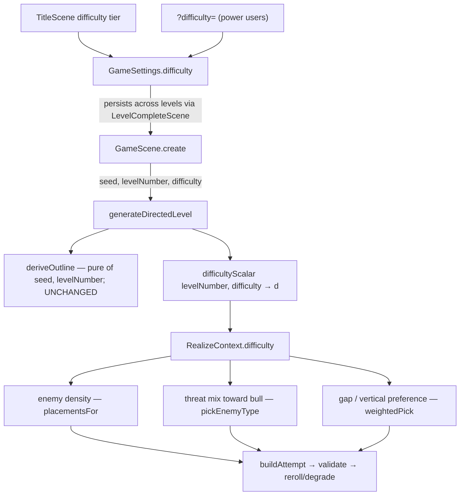

# feat: Difficulty progression (level ramp + menu-selectable difficulty)

## Summary

Introduce a difficulty scalar `d = f(levelNumber, difficulty)` and thread it through the existing
outline → realize → validate pipeline so generated levels get **absolutely** harder as the endless
run progresses and as the player raises a new title-menu difficulty tier. `d` scales enemy density,
threat mix, and gap/vertical terrain within the existing single-peak arc and the both-spawns
solvability guarantee. Existing enemy roster only; no new architecture.

---

## Problem Frame

The shipped outline-first generator never scales **absolute** intensity by level number. In
`src/levels/director/outline.ts`, `levelNumber` only selects the curve archetype (shape), width, and
beat count. The difficulty bands (`easy`/`medium`/`peak` in `src/levels/director/bands.ts`) are
**relative within a level** — a `peak` on level 2 is the same magnitude as a `peak` on level 40 — a
deliberate choice for an easy family co-op game (prior plan KTD9). Playtest feedback: "the levels
are kind of plain; I didn't get to anything challenging in the first 6 levels."

A profile of the current generator (mean over 60 seeds per level) confirms a flat line and a sparse
ceiling:

| level | enemies | bulls | gaps | maxGap (tiles) |
|-------|---------|-------|------|----------------|
| 1     | 0.7     | 0.13  | 0.0  | 0.0            |
| 2     | 4.0     | 0.97  | 0.2  | 0.8            |
| 6     | 4.2     | 0.98  | 0.1  | 0.4            |
| 12    | 4.3     | 1.18  | 0.1  | 0.3            |
| 40    | 4.3     | 1.45  | 0.2  | 0.8            |

Two root causes: (1) **no cross-level ramp** — level 40 is statistically identical to level 2; and
(2) **the peak is too sparse** even when present — ~4 enemies over ~300 tiles and a mean widest gap
under 1 tile (essentially no real pits). This plan fixes both while preserving the arc, determinism,
and solvability that the shipped generator guarantees, and adds a player-facing difficulty choice.

This is the first of two efforts. Difficulty progression ships first using the **existing** roster;
the Spiker and Flutter enemies — the content that makes a high `d` *interesting* rather than just
denser — are a separate follow-up (see Scope Boundaries).

---

## High-Level Technical Design

The difficulty signal originates at the title menu (or `?difficulty=`), persists on the shared
`GameSettings` object across the endless run, and is mapped to a single scalar `d` that feeds three
existing scaling seams in the realize layer. The outline layer is untouched.

**Curve shape (moderate, long runway).** `d` is ~0 (gentlest) through the early levels, climbs
steadily through the mid game so real challenge arrives around level 8–10, then continues a slow
creep with no hard plateau. Menu difficulty acts as an **offset/floor** on `d` (Easy shifts the curve
later/lower, Hard earlier/higher) — not a slope multiplier. Level 1 is hard-floored to the gentlest
`d` at every tier. Exact constants are an implementation tuning detail (see U1); the shape and the
floor are the contract.

---

## Key Technical Decisions

KTD1. **One difficulty scalar, one source of truth.** `d` and every intensity multiplier derived
from it live in a new pure module `src/levels/director/difficulty.ts` (`difficultyScalar(levelNumber,
difficulty)` plus a `difficultyParams(d)` that returns the concrete density/gap/threat multipliers).
Rationale: a single Node-testable, deterministic place to tune the whole curve; no scaling math
scattered across the realizer.

KTD2. **Absolute-intensity scaling lives in the realize layer, threaded via `RealizeContext` — the
outline stays difficulty-agnostic.** `deriveOutline` remains a pure function of `(seed, levelNumber)`
so its single-peak invariant and the stateless previous-level archetype exclusion (which recomputes
level N−1's choice) are untouched. Rationale: difficulty changes *how much* threat a beat realizes,
not *what shape* the arc is; keeping the outline pure protects the shipped arc/exclusion guarantees.

KTD3. **`d` scales within the existing bands and raises the baseline; it does NOT promote band
labels.** A level-12 `easy` beat is still an `easy` beat — denser/with-teeth, not relabeled
`medium`. Rationale: confirmed scope; preserves single-peak legibility and the coarse-band philosophy
(prior plan KTD9). The `scoreBand` verification rubric stays meaningful.

KTD4. **The three levers ride existing machinery.** Enemy count scales the `enemyDensity` already
read in `placementsFor`; threat mix biases the `enemyMix` already read in `pickEnemyType` (toward
`bull`); gaps/verticality ride the `gapBias` + low-ceiling weighting already in `weightedPick`.
Rationale: the seams exist; `d` multiplies into them rather than introducing new generation paths.

KTD5. **Menu difficulty reuses the existing `GameSettings.difficulty` field.** It is already parsed
from `?difficulty=`, defaulted (2), and persisted across levels. The title menu sets it to a small
set of tier values; the director maps `(levelNumber, difficulty)` → `d`. Rationale: no parallel
difficulty concept; the legacy procedural/hybrid generators keep reading the same field unchanged;
URL + persistence plumbing is reused, not rebuilt.

KTD6. **Level 1 is hard-floored to the gentlest `d` regardless of tier.** Combined with the existing
gentle-opener archetype (no peak), the family-friendly opener is preserved even on Hard. Rationale:
confirmed constraint — a co-op family game must not open on a wall.

KTD7. **Solvability stays a post-build guarantee, and we prove the ramp doesn't defeat it.** The
validator → reroll → degrade-to-spine ladder is unchanged. Because higher density/gaps could raise
reroll or degrade rates, the sweep is extended to sample difficulties and assert the
degrade-to-spine rate stays low. Rationale: a ramp that silently collapses hard levels to flat
spines would re-introduce "plain."

KTD8. **`difficulty` is added to `generateDirectedLevel` as an optional trailing parameter.** Signature
becomes `generateDirectedLevel(seed, levelNumber, theme?, difficulty?)`, defaulting to the current
behavior when omitted. Rationale: back-compatible with existing callers (the sweep and tests call
`(seed, level)`); no churn to unrelated call sites.

---

## Requirements

**Difficulty model**

- R1. Generated intensity rises with level number along a moderate, long-runway curve: gentle through
  the early levels, real challenge by ~level 8–10, slow endless creep, no hard plateau.
- R2. `d` is a pure, deterministic function of `(levelNumber, difficulty)`; generation stays
  byte-deterministic per `(seed, levelNumber, difficulty)`.
- R3. The baseline is raised so even early-game peaks have more teeth than today's ~4-enemy /
  no-pit output.
- R4. Level 1 remains a gentle opener at every difficulty tier.

**Menu difficulty**

- R5. The title menu lets the player choose a difficulty tier; the choice threads into generation and
  persists across the endless run (survives level transitions).
- R6. Menu difficulty affects generated intensity only — not lives, health, or physics.

**Scaling levers**

- R7. `d` raises enemy density, biases the threat mix toward bulls, and increases gap/vertical terrain
  preference — all within theme legality and the single-peak arc (no band-label promotion).

**Safety & evidence**

- R8. The both-spawns solvability invariant holds across levels × difficulties, and the
  degrade-to-spine rate stays low. Verified by the extended sweep.
- R9. A profiling tool prints mean enemies / gaps / maxGap / threat-mix across levels × difficulties,
  producing before/after evidence that the curve rises.

---

## Implementation Units

### U1. Difficulty scalar module

**Goal:** A pure, deterministic source of truth for `d` and the intensity multipliers it drives.

**Requirements:** R1, R2, R3, R4

**Dependencies:** none

**Files:**
- `src/levels/director/difficulty.ts` (new)
- `src/levels/director/difficulty.test.ts` (new)

**Approach:** Export `difficultyScalar(levelNumber: number, difficulty: number): number` returning
`d` (roughly `[0, 1+]`, unbounded-above for endless creep) with the moderate-long-runway shape and a
hard level-1 floor; and `difficultyParams(d)` returning the concrete multipliers the realize layer
applies (e.g. `densityScale`, `gapWeight`, `bullBias`). Menu `difficulty` enters as an offset/floor
on the level term (KTD5). Phaser-free / Node-importable. Keep the curve constants named and grouped
at the top of the file so tuning is a one-spot edit. Do not bake Phaser or scene imports in.

**Patterns to follow:** `configForDifficulty` in `src/levels/ProceduralGenerator.ts` (a difficulty →
config-multipliers mapping with a normalized `t`); the named-constants-at-top style of
`src/entities/Player.ts` and the director modules.

**Test scenarios:**
- `difficultyScalar` is monotonically non-decreasing in `levelNumber` at a fixed `difficulty`
  (sample levels 1→50).
- Level-1 floor: `difficultyScalar(1, dHard)` equals `difficultyScalar(1, dEasy)` within the floor —
  level 1 is gentlest regardless of tier (Covers R4).
- Tier ordering: at a fixed mid-game level, `d(easyTier) < d(normalTier) < d(hardTier)`.
- Long-runway shape: `d` stays near floor through the early levels and reaches its "real challenge"
  band around level 8–10 (assert thresholds at representative levels, not exact values).
- No hard plateau: `d(level=40) < d(level=80)` (endless creep continues).
- Determinism/purity: same `(levelNumber, difficulty)` returns an identical value across calls;
  `difficultyParams(d)` is monotonic in `d` for each multiplier it returns.

**Verification:** Unit tests pass; the module imports under vitest with no Phaser dependency.

---

### U2. Thread `d` into the realize layer

**Goal:** Apply `d` at the three existing scaling seams so density, threat mix, and gap/vertical
terrain rise with difficulty — without touching the outline.

**Requirements:** R2, R3, R7

**Dependencies:** U1

**Files:**
- `src/levels/realize/realizeLevel.ts` (extend `generateDirectedLevel` signature; compute `d`; pass
  into the realize context)
- `src/levels/realize/BeatRealizer.ts` (add `difficulty`/`d` to `RealizeContext`)
- `src/levels/realize/ChunkRealizer.ts` (apply `d` in `placementsFor`, `pickEnemyType`, and the
  `weightedPick`/`selectChunk` path)
- `src/levels/realize/ChunkRealizer.test.ts` (extend)
- `src/levels/director/Director.ts` (re-export already points at `generateDirectedLevel`; confirm the
  new optional param surfaces)

**Approach:** Compute `d = difficultyScalar(levelNumber, difficulty)` once in `generateDirectedLevel`
and carry it on `RealizeContext` (the context already flows `realizeLevel → realizeBeats →
ChunkRealizer.realize`). At the seams: multiply the effective `enemyDensity` by `densityScale(d)` in
`placementsFor`; bias `enemyMix` toward `bull` by `bullBias(d)` before `pickEnemyType`; raise the gap
/ low-ceiling weighting in `weightedPick` by `gapWeight(d)`. Keep band/verticality legality and the
single-peak arc intact (KTD3) — `d` changes weights and counts, never the requested band. When
`difficulty` is omitted/at floor, output must match current behavior (regression guard).

**Patterns to follow:** the existing `recipe.enemyDensity` thin/thicken logic in `placementsFor`; the
weighted-roll structure in `pickEnemyType` and `weightedPick`; `RealizeContext` field threading in
`realizeLevel.ts`.

**Test scenarios:**
- Density rises: mean enemy count over N seeds at a fixed level is higher at high `d` than at floor
  `d` (Covers R3, R7).
- Threat mix shifts: bull share of placed enemies increases with `d` at a fixed theme (Covers R7).
- Geometry: gap-bearing / vertical chunk selection frequency increases with `d` (assert via
  `chunkHasGap`/low-ceiling tagging over N seeds).
- Within-band invariant: a beat requesting `easy` still realizes an `easy`-or-easier `achievedBand`
  at high `d` — no band-label promotion (Covers KTD3).
- Regression: `generateDirectedLevel(seed, level)` (no difficulty arg) produces byte-identical output
  to the pre-change generator for a sample of seeds/levels (Covers R2).
- Determinism: `generateDirectedLevel(seed, level, theme, difficulty)` is byte-identical across
  repeated calls (Covers R2).

**Verification:** New scaling tests pass; the existing determinism and realize tests still pass;
`npx tsc --noEmit` clean.

---

### U3. Menu difficulty wiring

**Goal:** Let the player pick a difficulty tier on the title screen, thread it into generation, and
persist it across the endless run.

**Requirements:** R5, R6

**Dependencies:** U1, U2

**Files:**
- `src/settings.ts` (document/generalize `difficulty` as the shared baseline; optionally a tier→number
  map and a clamp note)
- `src/scenes/TitleScene.ts` (add a difficulty selector to the menu; merge the choice into the
  settings handed to `GameScene`)
- `src/scenes/GameScene.ts` (pass `this.settings.difficulty` into `generateDirectedLevel`)

**Approach:** Reuse `GameSettings.difficulty` (KTD5). In `TitleScene`, add a difficulty tier control
(e.g. a second selectable row, or a left/right cycle on the existing menu) that sets `difficulty`
when the player confirms; default tier maps to the current default so out-of-the-box feel is
unchanged at low levels. In `GameScene.create`, change the director call to
`generateDirectedLevel(directorBaseSeed, this.settings.levelNumber, undefined, this.settings.difficulty)`.
No change needed in `LevelCompleteScene` — it already forwards the whole `settings` object, so the
tier persists across the run for free. Menu difficulty must not alter lives/health/physics (R6).

**Patterns to follow:** the existing `OPTIONS`/`refresh`/`confirm` menu pattern and gamepad edge
detection in `src/scenes/TitleScene.ts`; `MODE_PRESETS` + `buildSettings` merge in `src/settings.ts`;
the existing `?difficulty=` parse in `parseSettingsFromURL`.

**Test scenarios:**
- `buildSettings({ difficulty })` merges and preserves the tier; `parseSettingsFromURL` still honors
  `?difficulty=` within its clamp (Covers R5).
- Persistence: a `GameSettings` passed Title → Game → LevelComplete → Game retains `difficulty`
  unchanged across the transition (Covers R5).
- Scope guard: changing `difficulty` does not change `lives`, `playerStates`, or any physics constant
  (assert settings/defaults untouched) (Covers R6).
- `Test expectation: none` for the pure-Phaser menu rendering — covered by runtime verification.

**Verification:** Settings unit tests pass; runtime check — launch the app, pick each tier, confirm
the chosen tier reaches generation (a temporary log of `(levelNumber, difficulty, d)` or the profile
tool) and that early levels stay gentle while later levels intensify.

---

### U4. Solvability + determinism re-validation across levels × difficulties

**Goal:** Prove the ramp keeps every level solvable from both co-op spawns and does not silently
collapse hard levels to the flat degrade spine.

**Requirements:** R2, R8

**Dependencies:** U2

**Files:**
- `src/levels/reachability/solvability.sweep.test.ts` (extend to sample difficulties)
- `src/levels/tools/sweep.ts` (accept an optional difficulty argument)
- `src/levels/realize/determinism.test.ts` (extend to include the difficulty axis)

**Approach:** Extend the sweep to iterate seeds × a representative set of `(levelNumber, difficulty)`
pairs (e.g. low/mid/high levels × easy/normal/hard tiers), asserting `validate(...).ok` and the
two-spawn/exit shape for all. Add a degrade-rate assertion: the fraction of generated levels that
fall back to the bare spine stays below a small threshold (so the ramp is producing real content,
not fallbacks). Extend `sweep.ts`'s CLI to take a difficulty so ad-hoc larger sweeps can target a
tier. Keep the existing self-consistency caveat in the file header honest.

**Patterns to follow:** the existing `runSweep(count, level)` structure and percentile/summary output
in `src/levels/tools/sweep.ts`; the seed-loop assertions in `solvability.sweep.test.ts`; the
byte-identity checks in `determinism.test.ts`.

**Test scenarios:**
- All sampled `(seed, level, difficulty)` levels pass the validator and have exactly 2 player spawns
  + an exit (Covers R8).
- Degrade-to-spine rate across the sampled space stays below the chosen threshold (Covers R8, KTD7).
- Determinism across the difficulty axis: identical `(seed, level, difficulty)` yields byte-identical
  `LevelData` (Covers R2).
- Generation time stays within the existing p99 budget at the highest difficulty (no pathological
  reroll blow-up).

**Verification:** `npm run sweep` (and the extended vitest sweep) pass at every sampled difficulty;
degrade-rate and timing assertions green.

---

### U5. Difficulty-profile tool

**Goal:** A reusable, Node-runnable tool that prints the difficulty curve so the ramp is provable
(before/after) and re-tunable.

**Requirements:** R9

**Dependencies:** U2

**Files:**
- `src/levels/tools/difficulty-profile.ts` (new)

**Approach:** Mirror `src/levels/tools/sweep.ts` (Phaser-free, tool-only, never imported by the app
bundle). For a configurable set of levels × difficulties, generate N seeds each and print mean enemy
count, bull share, gap count, widest gap, and width as a table. This is the same measurement that
produced the Problem Frame table; running it after U2/U3 must show the curve rising with both level
and tier.

**Patterns to follow:** the `runSweep`/`main`/entry-guard structure and ambient `process` declaration
in `src/levels/tools/sweep.ts`; gap detection by scanning the bottom row for non-solid columns.

**Test scenarios:** `Test expectation: none` — diagnostic tool, exercised by running it. Its
correctness is observable in the printed table (the curve rises across both axes).

**Verification:** `npx tsx src/levels/tools/difficulty-profile.ts` prints a table where mean
enemies/gaps rise with level number and with difficulty tier; `npx tsc --noEmit` stays clean.

---

## Scope Boundaries

**In scope:** the difficulty scalar, its three realize-layer levers, the title-menu tier, the
extended sweep, and the profile tool — using the existing Goomba/Koopa/Bull roster.

### Deferred to Follow-Up Work
- **Spiker and Flutter enemies** — the content that makes a high `d` *interesting* rather than just
  denser. Separate effort; difficulty progression ships first so they land on a curve that already
  rises.
- **Geometry scaling beyond chunk-selection bias** — if biasing toward gap-bearing/vertical chunks
  proves insufficient for the "pits" feel, a richer geometry lever (e.g. difficulty-driven
  verticality in the outline, or connector-introduced gaps) is a follow-up, weighed against KTD2's
  keep-the-outline-pure stance.
- **Per-theme difficulty tuning** — `d` currently composes with the fixed per-theme `enemyMix`/
  `gapBias`; theme-specific difficulty curves are a later refinement.

### Outside this effort
- **Player-stat difficulty** — menu difficulty deliberately does not change lives, health, or physics
  (R6). Those are a different knob if ever wanted.
- **Phase-2 synth realizer** — out of scope; the `BeatRealizer` interface is untouched.

---

## Risks & Dependencies

- **Higher intensity raises reroll/degrade pressure.** Denser enemies and more gaps can make the
  validator reject more attempts, inflating generation time or silently degrading to the flat spine.
  Mitigated by U4's degrade-rate and timing assertions; if pressure is high, cap the per-lever
  multipliers in `difficultyParams` rather than removing the lever.
- **Determinism regression.** Threading a new input through the realizer risks shifting the seeded
  stream for the default path. Mitigated by U2's byte-identity regression guard at floor `d`.
- **Tuning is felt, not proven.** The curve constants are a judgment call; the profile tool (U5) and
  playtest are the real validation loop. Expect a tuning pass after the first playtest.
- **Dependency:** U2 depends on U1; U3/U4/U5 depend on U2. No external dependencies.

---

## Sources & Research

- Flat-ramp root cause: `src/levels/director/outline.ts` (`deriveOutline`, `selectArchetype` —
  `levelNumber` drives only shape/width/beat-count); relative bands in
  `src/levels/director/bands.ts`.
- Scaling seams: `placementsFor` (`enemyDensity`) and `pickEnemyType` (`enemyMix`) in
  `src/levels/realize/ChunkRealizer.ts`; `weightedPick` (`gapBias` + low-ceiling) in the same file;
  `RealizeContext` in `src/levels/realize/BeatRealizer.ts`.
- Threading path: `generateDirectedLevel(seed, levelNumber, theme?)` in
  `src/levels/realize/realizeLevel.ts`; the director call + per-level seed handling in
  `src/scenes/GameScene.ts`; `GameSettings.difficulty` + `parseSettingsFromURL` in `src/settings.ts`;
  settings persistence in `src/scenes/LevelCompleteScene.ts`.
- Pattern for difficulty → multipliers: `configForDifficulty` in `src/levels/ProceduralGenerator.ts`.
- Prior context (constraints this inherits): the shipped plan
  `docs/plans/2026-06-14-001-feat-outline-first-level-generation-plan.md` (KTD9 coarse-bands, the
  solvability/degrade ladder, theme recipes) and the brainstorm
  `docs/brainstorms/2026-06-13-level-generation-variety-requirements.md` (family-co-op difficulty
  philosophy).
- Measured baseline (60 seeds/level) reproduced via an ad-hoc profile of `generateDirectedLevel`;
  U5 makes that measurement a permanent tool.
